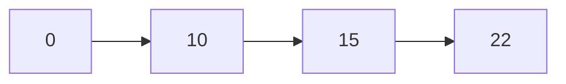
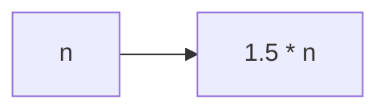

[返回目录](index.md)

|[集合](集合.md)|[**Collection**](Collection.md)|[Map](Map.md)|[Collections](Collections.md)|
|:-:|:-:|:-:|:-:|

- [Collection](Collection.md)
  - [List](List.md)
    - [**ArrayList**](ArraysList.md)
    - [Vector](Vector.md)
    - [LinkedList](LinkedList.md)
  - [Set](Set.md)
    - [HashSet](HashSet.md)
      - [LinkedHashSet](LinkedHashSet.md)


# ArrayList
- [ArrayList](#arraylist)
  - [ArrayList注意事项](#arraylist注意事项)
  - [ArrayList底层操作机制分析](#arraylist底层操作机制分析)
    - [源码分析](#源码分析)

## ArrayList注意事项
1）permits all elemets, including null：**ArrayList可以加入多个null，并且多个**  
2）`ArrayList`是由数组来实现数据存储的  
3）`ArrayList`基本等同于`Vector`, 但`ArrayList`是线程不安全的(**执行效率高**)；在多数情况下，不建议使用`ArrayList`

## ArrayList底层操作机制分析
1）ArrayList中维护了一个Object类型的数组`elementData`
```java
transient Object[] elementData;
// transient表示瞬间，短暂的
// 表示该属性不会被序列化
```
2）当创建ArrayList对象时，如果使用的是无参构造器，则初始 `elementData`容量为0，第一次添加，则扩容 `elementData`为10，如需要再次扩容，则扩容 `elementData`为1.5倍

3）如果使用的是指定大小的构造器，则初始的 `elementData`容量为指定大小，如果需要扩容，则直接扩容到 `elementData`为1.5倍



### 源码分析
- [空降](https://www.bilibili.com/video/BV1fh411y7R8?t=316.5&p=511)


