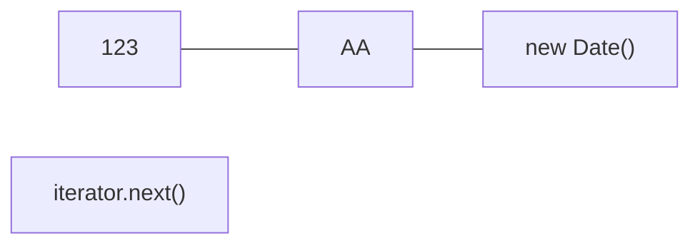

[返回目录](index.md)

|[集合](集合.md)|[**Collection**](Collection.md)|[Map](Map.md)|[Collections](Collections.md)|
|:-:|:-:|:-:|:-:|

- [**Collection**](Collection.md)
  - [List](List.md)
    - [ArrayList](ArraysList.md)
    - [Vector](Vector.md)
    - [LinkedList](LinkedList.md)
  - [Set](Set.md)
    - [HashSet](HashSet.md)
      - [LinkedHashSet](LinkedHashSet.md)


# Collection接口

- [Collection接口](#collection接口)
  - [继承关系](#继承关系)
  - [Collection接口实现类的特点](#collection接口实现类的特点)
  - [Collection接口的常用方法](#collection接口的常用方法)
  - [Collection接口遍历元素的方式](#collection接口遍历元素的方式)
    - [Iterator迭代器](#iterator迭代器)
    - [增强for循环](#增强for循环)


## 继承关系


## Collection接口实现类的特点


```java
public interface Collection<E> extends Iterable<E> {

}
```
1）`Collection`实现子类可以存放多个元素，每个元素可以是Object  
2）有些`Collection`实现子类，可以存放**重复的元素**，有些不可以  
3）`Collection`实现子类，有些是**有序的**(`List`)，有些不是有序的(`Set`)  
4）`Collection`接口没有直接的实现子类，是通过它的子接口`Set`和`List`来实现的
## Collection接口的常用方法
```java
public class CollectionMethod {
  public static void main(String[] args) {
    List list = new ArrayList();
    // add:添加单个元素
    list.add("jack");
    list.add(10);//list.add(new Integer(10))
    list.add(true);
    System.out.println("list=" + list);
    // remove:删除指定元素
    list.remove(0);//删除第一个元素
    list.remove("jack");//指定删除某个元素
    // contains:查找某个元素是否存在
    list.contains("jack");//true
    // size:获取元素个数
    list.size();//返回个数
    // isEmpty:判断是否为空
    list.isEmpty()//false
    // clear:清空元素
    list.clear();
    // addAll:添加多个元素
    Arraylist list2 = new Arraylist();
    list2.add("红楼梦");
    list2.add("三国演义");
    list.addAll(list2);
    // containsAll:查找多个元素是否同时存在
    list.containsAll(list2);//true
    // removeAll:删除多个元素
    list.removeAll(list2);
  }
}
```
## Collection接口遍历元素的方式
### Iterator迭代器
1）`Iterator`对象称为迭代器，主要用于遍历`Collection`集合中的元素  
2）所有实现了`Collection`接口的集合类都有一个`iterator()`方法，用以返回一个实现了`Iterator`接口的对象，即可返回一个迭代器  
3）`Iterator`的结构  
4）`Iterator`仅用于遍历集合，`Iterater`本身**并不存放对象**
```java
Iterator iterator = coll.iterator();//得到一个集合的迭代器
while (iterator.hasNext()) {//hasNext()判断是否有下一元素
  next();//下移，并返回下移以后位置的元素
  System.out.println(iterator.next());
}
```

**ps**：在调用`iterator.next()`方法之前必须要调用`iterator.hasNext()`进行检测。若不调用，且下条记录无效，直接调用`it.next()`会抛出`NoSuchElementException`异常

```java
//==========遍历案例===========
class Book {
  String name;
  String author;
  double price;
  public Book(String name, String author, double price) {
    this.name = name;
    this.author = author;
    this.price = price;
  }
  //重写toString
  public String toString() {
    return name + author + price;
  }
}
public class Test {
  public static void main(String[] args) {
    Collection col = new ArrayList();
    col.add(new Book("三国演义", "罗贯中", 10.1));
    col.add(new Book("小李飞刀", "古龙", 5.1));
    col.add(new Book("红楼梦", "曹雪芹", 34.6));
    Interator iterator = col.iterator();
    // 生成while迭代器快捷键 itit
    // 显示快捷键列表 ctrl + j
    while (iterator.hasNext()) {//判断下一个是否还有数据
      // 返回下一个元素类型为Object
      Object next = iterator.next();
      System.out.println("obj=" + next);
    }
  }
}
```
**ps2**：当退出while循环后，这时，iterator迭代器**指向最后一个元素**，如果需要再次遍历，需要重置迭代器
```java
//========重置迭代器========
iterator = col.iterator();
```


### 增强for循环
```java
for (元素类型 元素名 : 集合名或数组名) {
  访问元素;
}
```
```java
for (Object book : col) {
  System.out.println("book=" + book);
}
```
1）增强for也能在数组使用  
2）增强for在底层仍然是迭代器，可以理解为简化版本的迭代器遍历  
3）快捷方式：`I`或`col.for`


