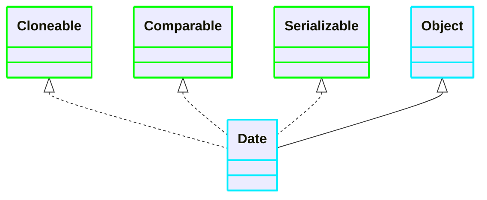
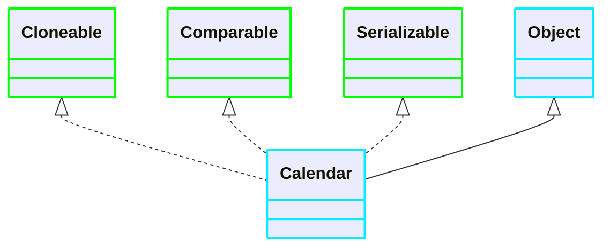

[返回](常用类.md)

# 日期类

- [日期类](#日期类)
  - [Date](#date)
    - [介绍](#介绍)
    - [Date使用方法](#date使用方法)
  - [Calendar](#calendar)
    - [Calendar的问题](#calendar的问题)
  - [LocalDate](#localdate)
    - [DateTimeFormatter的使用](#datetimeformatter的使用)
    - [Instant时间戳](#instant时间戳)
## Date
### 介绍

- [Properties和Fields空降](https://www.bilibili.com/video/BV1fh411y7R8?t=358.0&p=488)

1）Date：精确到毫秒，代表特定的瞬间

2）SimpleDateFormat：格式和解析日期的类




### Date使用方法
1）通过`Date()`获取当前时间，按照国外的字体格式  
>ps：该`Date`为`java.util.Date`下，而不是`java.sql.Date`

```java
Date d1 = new Date();//获取当前时间
Date d2 = Date(989385);//通过毫秒数得到时间
d2.getTime();//获取某个时间对应的毫秒数
```
2）使用 SimpleDateFormat  格式转换
```java
//创建 SimpleDateFormat 对象，可以指定相应的格式 
//这里的格式是规定好的，不能乱写
SimpleDateFormat sdf = new SimpleDateFormat("yyyy年MM月dd日 hh:mm:ss E");
//将日期转换成指定格式的字符串
String format = sdf.format(d1);
```
3）可以把一个格式化的String转成对应的Date
```java
String s = "1996年01月01日 10:20:30 星期一";
Date parse = sdf.parse(s);//需要抛出异常
```
> ps：在把一个String转换成一个Date时，使用的sdf格式需要和你给的String格式一样，否则会抛出一个转换异常 


## Calendar



第二代日期类，主要就是Calendar类

[方法演示空降](https://www.bilibili.com/video/BV1fh411y7R8?t=16.4&p=491)

`Calendar` 没有提供格式化的方法，需要程序员自己组合各个时间来输出

### Calendar的问题
1）可变性，日期和时间这样的类应该是不可变的  
2）偏移性：Date中的年份是从1900开始的，而月份都从0开始  
3）格式化：格式化只对Date有用，Calendar则不性  
4）此外，它们也不是线程安全的；不能处理闰秒等
## LocalDate
第三代日期类，在JDK8加入：  
`LocalDate`：日期，年月日    
`LocalTime`：时间，时分秒 
`LocalDateTime`：日期时间，日期时间   
[讲解空降](https://www.bilibili.com/video/BV1fh411y7R8?t=283.2&p=492)

### DateTimeFormatter的使用
```java
//获取当前时期和时间
LocalDateTime ldt = LocalDateTime.now();
//创建格式对象
DateTimeFormatter dtf = DateTimeFormatter.ofPattern("yyyy年MM月dd日 HH小时mm分钟ss秒");
//格式化
String format = dtf.format(ldt);
```
### Instant时间戳
类似于Date，提供了一系列和Date类转换的方式 
```java
//Instant --> Date;
Date date = Date.from(instant);
//Date --> Instant
Instant instant = date.toInstant();
```
- [讲解空降](https://www.bilibili.com/video/BV1fh411y7R8?t=525.2&p=493)