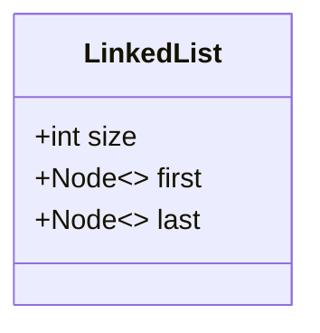

[返回目录](index.md)

|[集合](集合.md)|[**Collection**](Collection.md)|[Map](Map.md)|[Collections](Collections.md)|
|:-:|:-:|:-:|:-:|

- [Collection](Collection.md)
  - [List](List.md)
    - [ArrayList](ArraysList.md)
    - [Vector](Vector.md)
    - [**LinkedList**](LinkedList.md)
  - [Set](Set.md)
    - [HashSet](HashSet.md)
      - [LinkedHashSet](LinkedHashSet.md)


# LinkedList
- [LinkedList](#linkedlist)
  - [介绍](#介绍)
  - [LinkedList底层结构](#linkedlist底层结构)
  - [LinkedList增删改查源码分析](#linkedlist增删改查源码分析)
  - [遍历](#遍历)
  - [ArrayList和LinkeList的比较](#arraylist和linkelist的比较)

## 介绍
1）LinkedList底层实现了双向**链表**和双端**队列**特点  
2）可以添加任意元素(元素可以重复)，包括null  
3）**线程不安全**，没有实现同步
## LinkedList底层结构
1）LinkedList底层维护了一个双线链表  
2）LinkedList中维护了两个属性first和last分别指向首节点和尾节点  
3）每个节点(Node对象)，里面维护了prev、next、item三个属性，其中通过prev指向前一个，通过next指向后一个节点，最终实现双向链表  
4）所以LinkedList的元素的**添加和删除**，不是通过数组完成的，**相对来说效率较高**  
5）模拟一个**简单**的双向链表



- [ ] [双向链表模拟](双向链表模拟.md)   

## LinkedList增删改查源码分析
`CRUD`:create read update delete

```java
public class LinkedListCRUD {
  public static void main(String[] args) {
    LinkedList linkedList = new LinkedList();
    linkedList.add(1);
    linkedList.add(2);
  }
}
```


## 遍历
可以用增强for循环或迭代器遍历

## ArrayList和LinkeList的比较
||底层结构|增删和效率|改查的效率|
|:-:|:-:|:-:|:-:|
|ArrayList|可变数组|较低<br>数组扩容|较高|
|LinkedList|双向链表|较高，通过链表追加|较低|

1）如果需要改查操作多，选择`ArrayList`  
2）如果需要增删的操作多，选择`LinkedList`  
3）一般来说，在程序中，80%-90%都是查询，因此大部分情况下会选择`ArrayList`  
4）在一个项目中，根据业务灵活选择，也可能：一个模块使用`ArrayList`，另一个模块选择`LinkedList`
