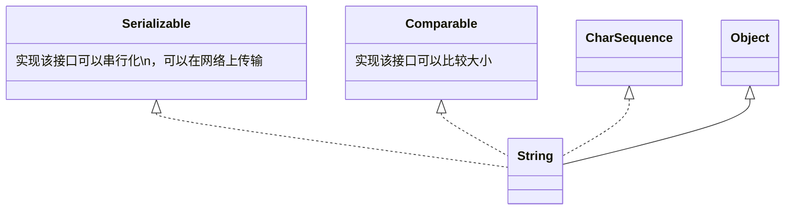

[返回](常用类.md)
# String
- [String](#string)
  - [介绍](#介绍)
  - [继承关系](#继承关系)
  - [创建String对象](#创建string对象)
  - [intern()方法](#intern方法)
  - [String的特性](#string的特性)
    - [案例1](#案例1)
    - [案例2](#案例2)
  - [String类的常用方法](#string类的常用方法)

## 介绍
1）String对象用于保存字符串，也就是一组字符序列  
2）**字符串常量对象**是用双引号括起的字符序列，例如`"你好"`,`"12.97"`,`"boy"`等  
3）字符串的字符使用的是`Unicode`字符编码，一个字符(不区分字母还是汉字)占两个字节  
4）String类较**常用的构造方法**(其他看手册)  
```java
String s1 = new String();
String s2 = new String(String original);
String s3 = new String(char[] a);
String s4 = new String(char[]a, int startIndex, int count);
String s5 = new String(byte[] b);
```
5）实现了`Serializable接口`，可以**串行化**，在网络上传输；实现了`Comparable接口`，可以比较大小  
6）`String`是`final`类，不能被其他的类**继承**  
7）`String`有属性`private final char value[];`用于存放字符串内容：`value`是一个`final`类型，不可以修改  
ps：`value`**是一个地址**，`value[i]`**是其指向的数据内容**
## 继承关系



## 创建String对象

1）方式一：直接赋值`String s = "hspedu"`;  
2）方式二：调用构造器`String s = new String("hspedu")`;

1）方式一介绍：先从**常量池**查看是否有`"hsp"`数据空间，如果有，直接直向；如果没有则重新创建，然后指向。`s`最终指向的是**常量池**的空间地址  

2）方式二介绍：先在堆中创建空间，里面维护了`value属性`，指向常量池的`hsp空间`。如果常量池中没有`"hsp"`，则创新创建，如果有，直接通过`value`指向。最终指向的是**堆**中的空间地址

```java
直接赋值：String s = "hsp";               
调用构造器：String s2 = new String("hsp");
```


<div class="di">
+---------------Jvm的内存:String的内存布局---------------+
| 栈          | 堆                                       |
|             |  +----<b>0x11</b>----+                          |
|             |  |value:[<strong>0x99</strong>]|--+                       |
|         +---|->+            |  |                       |
|         |   |  |            |  |                       |
|         |   |  +------------+  |                       |
|         |   +------------------------------------------+
|         |   | 方法区           |                       |
|         |   |                  |                       |
|main方法 +   | +--常量池 ---+   |                       |
|s2->[<b>0x11</b>]   | |            |   |                       |
|s->[<strong>0x99</strong>]+---|-|>"hsp"[<strong>0x99</strong>]<---+                       |
|             | |            |                           |
|             | |            |                           |
|             | +------------+                           |
+-------------+------------------------------------------+</div>

## intern()方法

```java
String a = "hsp";
String b = new String("hsp");
System.out.println(a.equals(b));//T
System.out.println(a == b);//F
System.out.println(a == b.intern());//T
System.out.println(b == b.intern());//F
```

<div class="di">
          堆
          +-----------+
<b>b</b>---------|--> value  |
          +-------+---+
                  |     <strong>b.intern</strong>
          常量池  |        +
          +-------v---+    |
<b>a</b>---------|--->"hsp"<-|----+
          +-----------+

</div>

当调用`intern`方法时，如果池中已经包含了一个等于此`String`对象的字符串(用`equals(Object)方法`确定)，则返回池中的字符串。否则，将此`String`对象添加到池中，并返回此`String`对象的引用

```java
ps:"hspedu"返回的地址就是常量池的地址
```


## String的特性
### 案例1

```java
//以下语句创建了几个对象 
String s1 = "hello";
s1 = "haha";
//两个 
```
```java
//以下语句创建了几个对象
String a = "hello" + "abc";
//编译器优化为|
//          |
//          v
String a = "helloabc";
//只有一个对象
```
```java
//以下语句创建了几个对象
String a = ”hello“;
String b = "abc";
//
String c = a + b;
//答：一共创建了3个对象
//===========具体执行如下===========
//1）先创建一个
StringBuilder sb = StringBuilder();
//2）执行
sb.append("hello");
//3）执行
sb.append("abc");
//4）调用
sb.toString();
/*
toString() {
  return new String(value, 0 , count)
}
*/
//将其返回给c
//============举一反三==============
String d = "helloabc"
System.out.println("c == d")//F
```
其实是让c指向堆中的对象(`String`)，其属性`value[]`指向池中的`"helloabc"`  
**小结**：常量相加，看池；变量相加，在堆中


### 案例2

```java
public class Test1 {
  String str = new String("hsp");
  final char[] ch = {'j', 'a', 'v', 'a'};
  public void change(String str, char ch[]) {
    str = "java";
    ch[0] = 'j';
  }
  public static void main(String[] args) {
    Test1 ex = new Test1();
    ex.change(ex.str, ex.ch);
    System.out.print(ex.str + "and");
    System.out.println(ex.ch);
    //结果：hspandhava
  }
}
```


## String类的常用方法

说明：String类是保存字符串常量的，每次更新都需要重新开辟新空间，效率较低，因此java设计者还提供了`StringBuilder`和`StringBuffer`来增强String的功能，并提高效率 

---
- `equals`：**区分大小写**，判断内容是否相等
- `equalsgnoreCase`：**忽略大小写**，判断内容是否相等
- `length`：获取字符的个数，字符串的长度
- `indexOf`：获取字符(**或串**)在字符串中第一次出现的索引，索引从0开始，如果找不到，返回 **-1**
- `lastIndexOf`：获取字符在字符串中最后一次出现的索引，索引从0开始，如果找不到，返回 **-1** 
- `substring`：截取指定范围的子串
  - `name.substring(6)`：截取索引6及其后面的字符
  - `name.substring(0,5)`：从索引0开始，截取到索引`5-1`的位置
- `trim`：去前后空格
- `charAt`：获取某索引处的字符，注意不能使用`Str[index]`这种方式
---
- `toUpperCase`：全变成大写
- `toLowerCase`：全变成小写
- `concat`：拼接
  - `a.concat("dd").concat("cc")`
- `replace`：替换字符串中的字符
  - `s1.replace(a, b)`：把a替换为b
  - `s1.repace()`方法执行后返回的结果是替换过的对象，对**s1本身**没有任何影响
- `split`：分割字符串，对于某些分割字符，我们需要转义`\`
  - `poem.split(",")`：以逗号为标准进行分隔，返回一个**字符串数组**，`，`就没有了
- `compareTo`：比较两个字符串的大小
  - `a.compareTo(b);`：前者大，返回正数；后者大，返回负数；相等，返回0
  - **长度相同**，**且每个字符也相同**，返回0
  - **长度相同或不同**，但是在比较时，**可以区分大小**，就返回c1-c2
  - **长度不同**，**前面的部分都相同**，返回`str前.len-str后.len`
- `toCharArray`：字符串转为字符数组
  - `char[] chs = s.toCharArray();`
- `format`：格式字符串
  - 占位符：`%s`(**字符串**)，`%d`(**整数**)，`%.2f`(**小数,四舍五入,保留2位**)，`%c`(**使用char替换**);
  - 占位符由后面的变量还替换

```java
String info2 = 
String.format("我的姓名是%s 年龄是%d 
成绩是%.2f 性别是%c 希望大家喜欢我"
, name, age, score, gender);
```