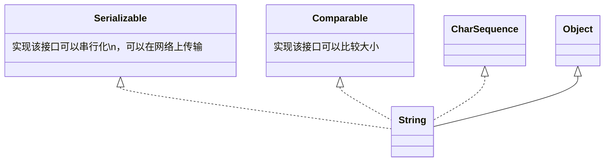

[返回](常用类.md)
# String
- [String](#string)
  - [介绍](#介绍)
  - [继承关系](#继承关系)

## 介绍
1）String对象用于保存字符串，也就是一组字符序列  
2）**字符串常量对象**是用双引号括起的字符序列，例如`"你好"`,`"12.97"`,`"boy"`等  
3）字符串的字符使用的是`Unicode`字符编码，一个字符(不区分字母还是汉字)占两个字节  
4）String类较**常用的构造方法**(其他看手册)  
```java
String s1 = new String();
String s2 = new String(String original);
String s3 = new String(char[] a);
String s4 = new String(char[]a, int startIndex, int count);
String s5 = new String(byte[] b);
```
5）实现了`Serializable接口`，可以**串行化**，在网络上传输；实现了`Comparable接口`，可以比较大小  
6）`String`是`final`类，不能被其他的类**继承**  
7）`String`有属性`private final char value[];`用于存放字符串内容：`value`是一个`final`类型，不可以修改  
ps：`value`**是一个地址**，`value[i]`**是其指向的数据内容**
## 继承关系


