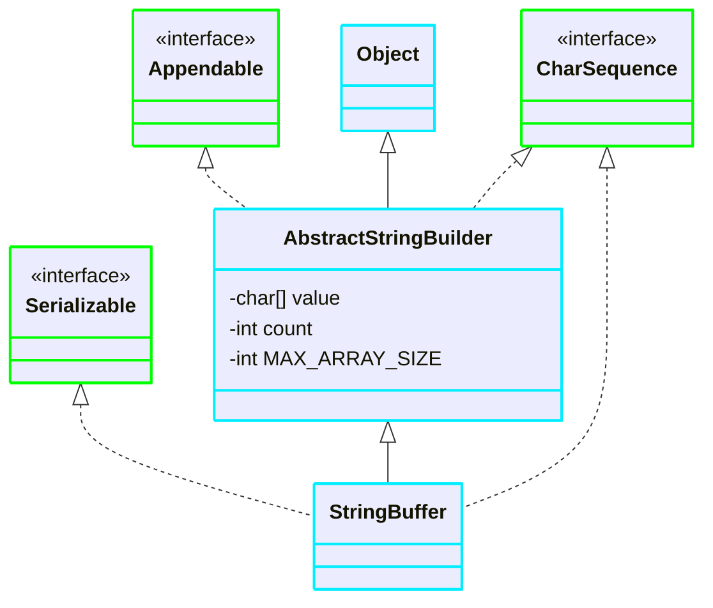

[返回](常用类.md)


# StringBuffer

[空降](https://www.bilibili.com/video/BV1fh411y7R8?t=17.7&p=475)


- [StringBuffer](#stringbuffer)
  - [源码](#源码)
  - [继承关系](#继承关系)
  - [StringBuffer对比String](#stringbuffer对比string)
  - [StringBuffer的构造器](#stringbuffer的构造器)
  - [String和StringBuffer相互转换](#string和stringbuffer相互转换)
  - [StringBuffer常用方法](#stringbuffer常用方法)
  - [例题](#例题)

## 源码
```java
//父类
abstract class AbstractStringBuilder implements Appendable, CharSequence {
    char[] value;//不是final类型的
    //该value数组存放字符串内容
    //因此StringBuffer存放在堆中
    int count;
    ...
}
//StringBuffer类，是个final类,不能被继承
public final class StringBuffer
    extends AbstractStringBuilder
    implements java.in.Serializable, CharSequence
{
}
```

## 继承关系


## StringBuffer对比String
1）String保存的是字符串常量，里面的值不能更改，每次String类的更新实际上就是更改地址，效率较低
```java
private final char value[]
```  
2）StringBuffer保存的是字符串变量，里面的值可以更改，每次StringBuffer的更新实际上可以更新内容，**不用每次更新地址**，效率更高
```java
char[] value;//放在堆里
```

## StringBuffer的构造器


- `StringBuffer`()
  - 构造一个不带字符的字符串缓冲区，初始容量为16个字符
```java
StringBuffer stringBuffer = new StringBuffer();
//创建一个大小为16的char[]数组，用于存放字符内容
```
- `StringBuffer`(`CharSequence` seq)
  - 直接把CharSequence seq 的内容放进去
  - 用的不多
- `StringBuffer`(`int` capacity)
  - 可以指定`char[]`数组的大小
- `StringBuffer`(`String` str)
```java
StringBuffer hello = new StringBuffer("hello");

//============构造器如下============
public StringBuffer(String str) {
    super(str.length() + 16);
    append(str);
}
AbstractStringBuilder(int capacity) {
    value = new char[capacity];
}
```

## String和StringBuffer相互转换

```java
//String --> StringBuffer
String str = "hello tom";
//方式1：使用构造器
//返回的是StringBuffer对象，对str本身没有影响
StringBuffer stringBuffer= new StringBuffer(str);
//方式2：使用append(String str)方法
StringBuffer stringBuffer1= new StringBuffer();
StringBuffer append = stringBuffer1.append(str);

//StringBuffer --> String
StringBuffer stringBuffer3("hspedu")
//方式1：使用StringBuffer提供的 toString()方法
String s = stringBuffer3.toString();
//方式2：使用构造器
String s1 = new String(stringBuffer3);
```

## StringBuffer常用方法
- `append` 增
- `delete(start, end)` 删
  - 删除索引为`>=start  &&  <end`处的字符
  - 删除11~14的字符，不包含14：`[11,14)`
- `replace` 改
  - `s.replace(9, 11, "周芷若");`：使用**周芷若**替换`[9，11)`字符
- `indexOf` 查
- `insert` 插
  - `s.insert(9,"赵敏")`：在索引为9的位置插入`"赵敏"`，原来索引为9的内容自动后移
- `length` 获取长度

## 例题
- [看源码题](https://www.bilibili.com/video/BV1fh411y7R8?t=12.7&p=478)


<details><summary>打印<123,456.00>逗号题</summary>

```java
public class Modify {
    public static void main(String[] args) {
        //1)定义一个Scanner对象,接收用户输入的价格(String)
        //2)希望使用到StringBuffer的insert,需要将String转成StringBuffer
        //3)然后使用相关方法进行处理
        String price = "323123456.59";
        StringBuffer sb = new StringBuffer(price);
        //找到小数点的索引,在该位置的前3位插入即可
        for (int i = sb.lastIndexOf(".") - 3; i > 0; i-=3) {
            sb = sb.insert(i, ",");
        }
        System.out.println(sb);
    }
}
```

</details>