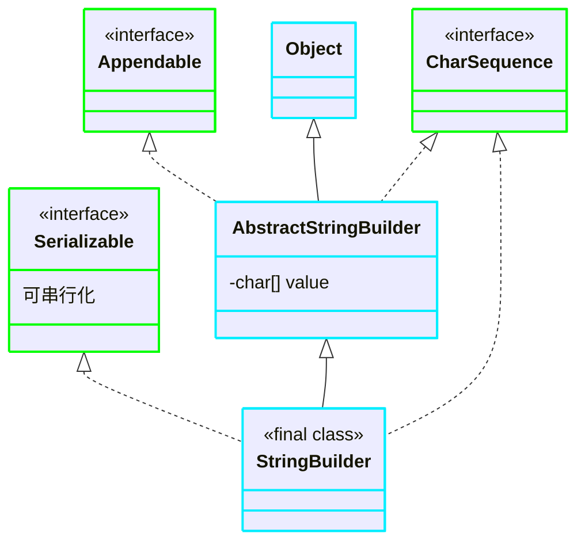

[返回](常用类.md)

# StringBuilder
- [StringBuilder](#stringbuilder)
  - [介绍](#介绍)
  - [继承关系](#继承关系)
- [String StringBuffer StringBuilder对比](#string-stringbuffer-stringbuilder对比)
  - [使用原则](#使用原则)

## 介绍

1）一个可变的字符序列，此类提供一个与`StringBuffer`兼容的`API`，但不保证同步(**StringBuilder不是线程安全的**)。该类被设计用作`StringBuffer`的一个简易替换，用在字符串缓冲区被**单个线程使用的时候**。  
如果可能，**建议优先采用该类，因为在大多数时候，它比StringBuffer要快**

2）在`StringBuilder`上的主要操作是`append`和`insert`方法，可重载这写方法，以接受任意类型的数据

## 继承关系

>1）`StringBuider`继承`AbstractStringBuilder`类  
2）实现`Serializable`可串行化  
3）`StringBuilder`是`final`类，不能被**继承**  
4）`StringBuilder`对象字符序列存放在**父类**的`value`中，即**堆**中  
5）`StringBuilder`的方法没有做**互斥(同步)**处理，因此推荐在**单线程**的情况下使用  

# String StringBuffer StringBuilder对比
1）`StringBuilder` 和 `StringBuffer` 非常类似，鋆代表可变字符序列，而且方法也一样  
2）`String`：**不可变字符序列**，**效率低**，**但复用率高**。  
3）`StringBuffer`：**可变字符序列**，**效率较高**(可增删)，**线程安全**  
- 使用了`synchronized`关键字  
  
4）`StringBuilder`：**可变字符序列**，**效率最高**，**线程不安全**  
5）`String`使用注意说明：  
>`String s = "a";`：创建了一个字符串。  
`s += "b";`：实际上原来的"a"字符已经丢弃了，现在又产生了一个字符串`s+"b"`(即`"ab"`)。如果多次执行这些改变串内容的操作，会导致大量副本字符串对象留存在内存中，降低效率。如果这样的操作放到循环中，会极大影响程序性能  
**结论** ==> 如果需对`String`做**大量修改**，**不要使用**`String`

|效率排行|||||
|:-:|:-:|:-:|:-:|:-:|
|`StringBuilder`|>|`StringBuffer`|>|`String`|

## 使用原则
- 如果字符串存在大量修改操作，一般使用`StringBuffer`或`StringBuilder`  
  - 如果字符串存在大量修改操作，并在**单线程情况**，使用`StringBuilder`
  - 如果字符串存在大量修改操作，并在**多线程情况**，使用`StringBuffer`
- 如果字符串很少修改，被多个对象引用，使用`String`，**比如配置信息**  

`StringBuilder`的使用方法和`StringBuffer`一样 

