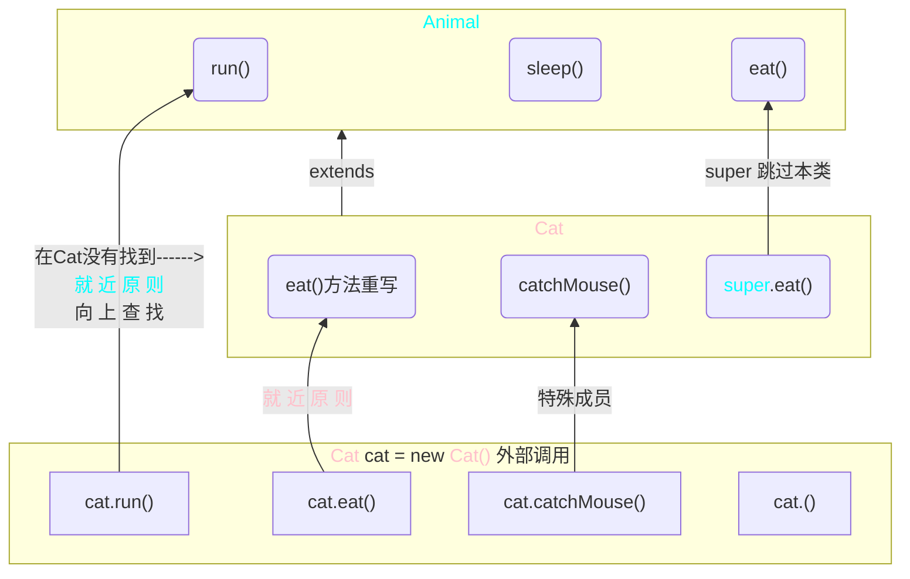

[返回](面向对象编程.md)

# super

- [super](#super)
  - [介绍](#介绍)
  - [语法](#语法)
  - [使用细节](#使用细节)
  - [和this比较](#和this比较)


## 介绍
super代表父类的引用，用于访问父类的属性、方法、构造器


## 语法
1）访问父类的属性，但不能访问父类的private属性
```java
super.属性名;
```
2）访问父类的方法，不能访问父类的private方法
```java
super.方法名(参数列表);
```
3）访问父类的构造器
- [继承](继承.md#使用细节)
```java
super(参数列表);
//只能放在构造器的第一句，只能出现一句！
```

```java
public class A {
    public int n1 = 100;
    protected int n2 = 200;
    int n3 = 300;
    private int n4 = 400;
    //==============
    public void test100() { }
    protected void test200() { }
    void test300() { }
    private void test400() { }
}

public class B extends A{
    public void hi() {
        System.out.println(super.n1);//n1,n2,n3可以访问，n4不可以
    }
    public void ok() {
        super.test100();//可以调100,200,300；400不行
    }
}
```
## 使用细节
1）调用父类构造器的好处：分工明确，**父类属性由父初始化**，**子类属性由子类初始化**  

2）当子类中有和父类中的成员(属性和方法)**重名时**，为了访问父类的成员，必须通过super。**如果没有重名**，使用super、this、直接访问是一样的效果

<center> 
<font color="pink">子类成员继承关系图</font>


</center>

```java
在父类中查找 方法 或 属性 的顺序：
1）先找本类，如果有则调用
2）如果没有，找父类，有且可以调用则调用
3）如果父类没有，则继续向上直到Object类
提示：
1）在查找的过程中，如果找到了，但不访问，则报错
2）在查找的过程中，没有找到，则提示方法不存在
this.call(); 等价于 call();
super.call(); 直接从父类开始查找，跳过本类
```

3）suepr的访问不限于直接父类，如果**爷爷类和本类中有同名的成员**，也可以使用super去访问，如果多个基类中都有同名的成员，则使用super访问遵循**就近原则**

## 和this比较

||this|super|
|:-:|:-:|:-:|
|访问属性|访问本类属性，没有此属性则从父中继续查找|跳过本类，按照就近原则从父类开始查找属性|
|调用方法|同上|同上|
|调用构造器|调用本类构造器，必须放在首行|调用父类的构造器，必须放首行|
|特殊|表示当前对象|子类中访问父类|

