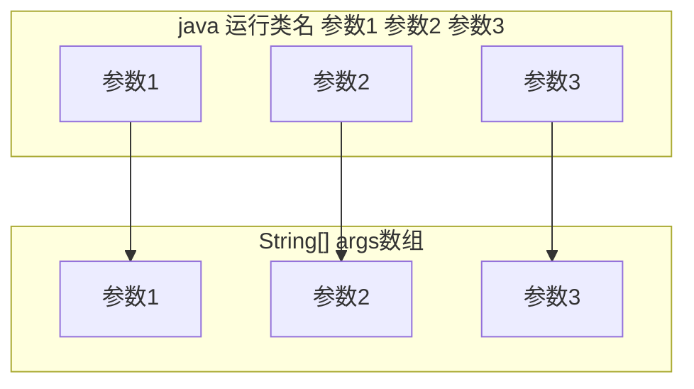

<meta name="viewport" content="width=device-width, initial-scale=1.0, viewport-fit=cover">

[返回](面向对象编程.md)

# main方法
- [main方法](#main方法)
  - [介绍](#介绍)
  - [特别提示](#特别提示)

## 介绍

1）main()方法是**java虚拟机**在调用  
2）java虚拟机需要调用类的main()方法，所以该方法访问权限必须是**public**  
3）java虚拟机在执行main()方法时**不必创建对象**，所以该方法必须是**static**  
4）该方法接收**String类型**的**数组参数**，该数组中保存执行java命令时传递给所运行类的参数  
5）**java执行程序 传参**



```java
public class Hello {
    public static void main(String[] args) {
        for (int i = 0; i < args.length; i++) {
            System.out.println("第" + (i+1) + "个参数为" + args[i]);
        }
    }
}
```

## 特别提示
1）在main()方法中，可以**直接调用**main方法所在类的静态方法或静态属性  
2）但不能直接访问该类中的**非静态成员**，必须创建一个对象，通过这个对象去访问静态成员

```java
public class A {
    private int n = 1;
    public static void main(String[] args) {
        hi();//可以直接访问
        n = 2;//不可以访问非静态属性
    }
    public static void hi() {}
}
```