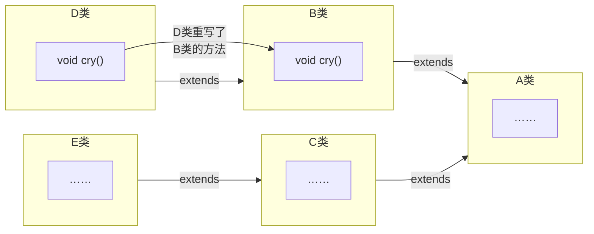

<meta name="viewport" content="width=device-width, initial-scale=1.0, viewport-fit=cover">


[返回](面向对象编程.md)

[overload](overload.md)

# override
- [override](#override)
  - [介绍](#介绍)
  - [案例入门](#案例入门)
  - [使用细节](#使用细节)
  - [和方法重载的比较](#和方法重载的比较)

## 介绍
**方法重写或方法覆盖**：override就是子类中有一个方法，和父类的某个方法名称、返回类型、参数一样，那么就是子类的这个方法覆盖了父类的那个方法（**就近原则**）  
---->即优先调用近的
## 案例入门



## 使用细节
方法重写也叫方法覆盖，需要满足以下条件：  
1）子类的方法<font color="pink">参数、方法名称</font>要和父类方法的参数，方法名称**完全一样**  
2）子类的返回类型和父类方法**返回类型**一样，或者是父类返回类型的子类  
```java
//String… 可重写 Object…
class Animals {
    public Object getInfo(){} //父类的方法
}
class Dog extends Animals {
    public String getInfo(){} //子类的方法
}
```  
3）子类方法不能缩小父类方法的访问权限  
```java
public > protected > 默认 > private
```


## 和方法重载的比较

[方法重载](overload.md)

||范围|方法名|参数列表|返回类型|修饰符|
|:-:|:-:|:-:|:-:|:-:|:-:|
|overload|本类|**相同**|类型、个数、顺序至少有一个不同|无要求|无要求|
|override|父子类|**相同**|**相同**|**相同**或继承|不能缩小父类范围|