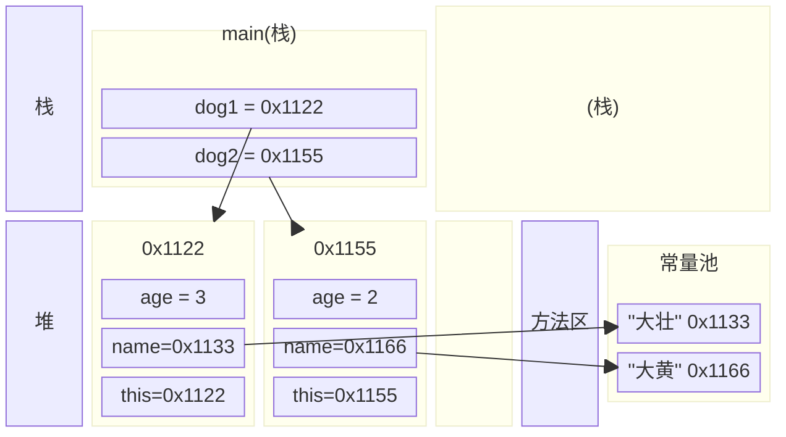

<meta name="viewport" content="width=device-width, initial-scale=1.0, viewport-fit=cover">

[返回](面向对象编程.md)
# this
- [this](#this)
  - [介绍](#介绍)
  - [案例入门](#案例入门)
  - [使用细节](#使用细节)
  - [小结](#小结)

## 介绍
[空降](https://www.bilibili.com/video/BV1fh411y7R8?t=2.8&p=247)  
问题引入：构造器的输入参数不是非常友好，如果能将int pName改成 name 就好了，但是如果按照变量的作用域原则，name的值就 null，怎么解决

<font color="pink">什么是this：java虚拟机会给每个对象分配this，代表当前对象。</font>

## 案例入门 
```java
public class This {
    public static void main(String[] args) {
        Dog dog1 = new Dog("大壮", 3);
        Dog dog2 = new DOg("大黄", 2);
    }
}
class Dog {
    int age;
    String name;
    public Dog(String name, int age) {
        //当前对象的属性name
        //指 new 出来的对象
        this.name = name;
        //当前对象的属性age
        this.age = age;
    }
}
```


## 使用细节
1）this 关键字可以用来访问本类的属性、方法、构造器  
2）this 用于区分当前的类和属性的局部变量  
3）访问成员的语法：`this.方法名(参数列表);`  

```java
public class ThisDetail {
    public static void main(String[] args) {
        T t1 = new T();
        t1.t2();
    }
}
class T {
    int age;
    String name;
    public void f1() {
        System.out.println("f1()方法被调用")
    }
    public void f2() {
        System.out.println("f2()方法被调用")
        // 想在此调用本类的f1方法
        // 1）直接用
        f1();
        // 2）this.f1
        this.f1();
    }
}
```

4）<font color="pink">访问构造器</font>的语法：`this(参数列表);` **注意只能在构造器中使用，即只能在构造器中访问另外一个构造器**  
```java
public class ThisDetail {
    public static void main(String[] args) {
        T t2 = new T();
    }
}
class T {
    int age;
    String name;
    public T() {
        //想在这里访问T(String name, int age)构造器
        //注意：如果有this访问构造器的语法，必须置于第一条语句
        this("jack", 100);
        System.out.println("T()构造器被调用")
    }
    public T(String name, int age) {
        System.out.println("T(String name, int age)构造器被调用")
    }
}
```
5）this 不能在**类定义**的外部使用，只能在**类定义的方法**中使用

```java
class T { 
    String name = "tom";
    public void f3() {
        String name = "smith";
        System.out.println("name=" + name);//就近原则找到属性
        System.out.println("name=" + this.name);//直接找到属性
    }
}
```


## 小结
<font color="pink">哪个对象调用，this就代表哪个对象 </font>