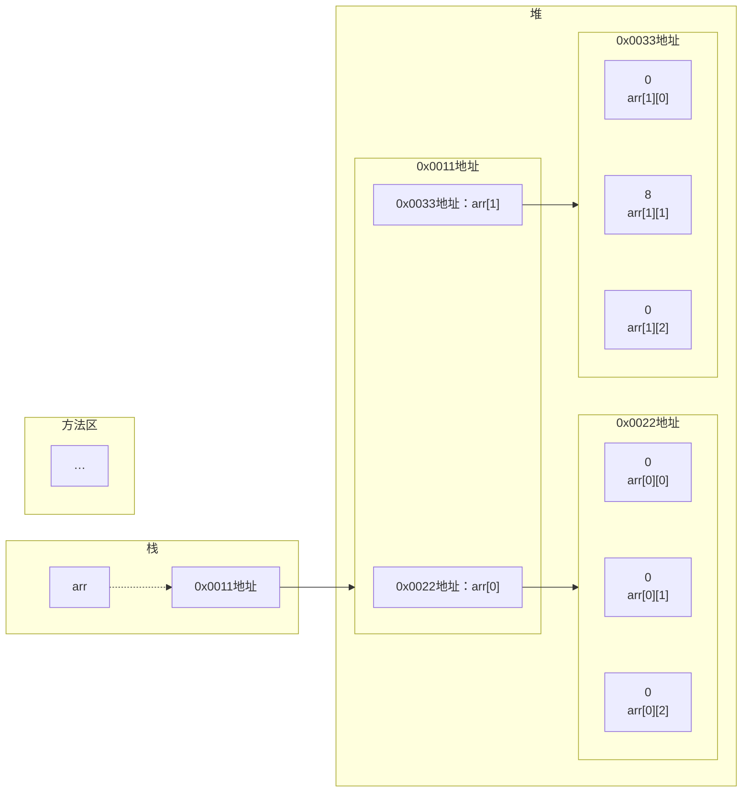

[返回](多维数组.md#使用方式1动态初始化)
# 二维数组内存图

```java
public class TwoDimensionalArray02{
    public static void main(String[] args){
        int arr[][] = new int[2][3];
        for(int i = 0; i < arr.lengh; i++){
            for(int j = 0; j < arr[i].lengh; j++){
                System.out.println(arr[i][j] + " ");
            }
            System.out.println();//换行
        }
    }
}
```
```java
int arr[][] = new int[2][3];
arr[1][1] = 8;
```
<center><strong>JVM内存</strong></center>



