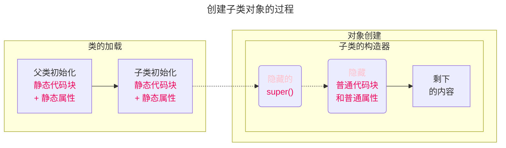

<meta name="viewport" content="width=device-width, initial-scale=1.0, viewport-fit=cover">

[返回](面向对象编程.md)

# 代码块
- [代码块](#代码块)
  - [介绍](#介绍)
  - [基本语法](#基本语法)
  - [使用细节](#使用细节)
    - [调用顺序](#调用顺序)
  - [案例演示](#案例演示)

## 介绍
代码块又称为**初始化块**，**属于类中的成员**（类的一部分），类似与方法，将逻辑语句封装在方法体中，通过`{}`包围起来

但和方法不同，没有方法名，没有返回值，没有参数，**只有方法体**，而且不用通过对象或类显式调用，而是加载类或创建对象时隐式调用

## 基本语法
```java
[修饰符(static)]{
    代码
}
```
1）修饰符可选，要写也只能写**static**  
2）代码块分两类：使用static的叫**静态代码块**，没有static修饰的，叫**普通代码块**  
3）**逻辑语句**可以为任何逻辑语句(输入、输出、方法调用、循环、判断等)  
4）`;`号可以写上，也**可以省略**   
5）代码块的调用**优先于**构造器的调用

## 使用细节

1）**static代码块**也叫静态代码块，作用是**对类进行初始化**，而且它随着类的加载而执行，**并且只会执行一次**。如果是普通代码块，每创建一个对象，就会执行

2）类什么时候被加载： #⭐  
①创建**对象实例**时(new)  
②创建子类对象实例时，**父类**会先被加载  
③使用类的**静态成员**(静态属性，静态方法)时


3）普通代码块，在**创建对象实例**时，会被隐式的调用，被**创建一次**，就会**调用一次**。  
如果只是**使用类的静态成员**时，普通代码块不会执行
>可以理解为：普通代码块在构造器调用时被调用

### 调用顺序

|1） <font color="pink">创建一个对象时，在一个类调用的顺序：</font> |
|:-|
|①调用**静态代码块**和**静态属性**初始化 <br>二者优先级一样，如果有多静态代码块和多个静态变量则按**其定义的顺序**调用 |
|②调用**普通代码块**和**普通属性**的初始化<br>二者优先级一样，如果有多普通代码块和多个普通属性则按**其定义的顺序**调用|
|③调用**构造器**|
||

2）构造器的最前面隐含了**super()** 和**调用普通代码块**

```java
class A {
    public A() {
        //隐含 super()
        //隐含 调用普通代码块和普通属性初始化
        System.out.println("ok");
    }
}
```

|3） <font color="pink">创建子类对象的调用顺序：</font> |
|:-|
|①父类的静态代码块和静态属性(优先级一样，按定义顺序执行)|
|②子类的静态代码块和静态属性(优先级一样，按定义顺序执行)|
|③父类的普通代码块和普通属性初始化(优先级一样，按定义顺序执行)|
|④父类的构造器|
|⑤子类的普通代码块和普通属性初始化(优先级一样，按定义顺序执行)|
|⑥子类的构造器|
||



```java
B extends A
new B() 时
//1）首先进行类的加载：静态属性和静态代码块
//2）创建对象，进入子类对象的构造器
//3）子类构造器隐藏了：①super() ②调用普通代码块和属性
```
4）**静态代码块**只能调用**静态成员**(静态方法和静态属性)，普通代码块可以调用任意成员

## 案例演示  
1）相当于另外一种形式的构造器(**对构造器的补充机制**)，可以做初始化的操作  
2）如果**多个构造器中都有重复的语句**，可以抽取到初始化块中，提高代码的重用性   

```java
class Movie {
    private String name;
    private double price;
    private String director;
    //不管调用哪个构造器创建对象，都会先调用代码块
    {
        System.out.println("电影屏幕打开...");
        System.out.println("广告开始...");
        System.out.println("电影正式开始...");
    }
    public Movie(String name) {
        this.name = name;
    }
    public Movie(String name, double price) {
        this.name = name;
        this.price = price;
    }
    public Movie(String name, double price, String director) {
        this.name = name;
        this.price = price;
        this.director = director;
    }
}
```