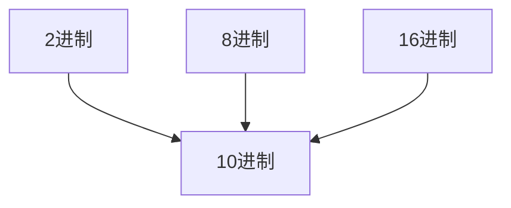

---
 
---
- [返回](运算符.md)  
- [二进制](二进制.md)
- [其他进制-->10进制](其他进制-->10进制.md) 
- [10进制-->其他进制](10进制-->其他进制.md)  
- [2进制-->其他进制](2进制-->其他进制.md) 
- [8进制16进制-->转2进制](8进制16进制-->转2进制.md) 
---

- ---
#### 2进制转10进制
- 从最低位开始，$每个位的数\times2^{位数-1}$ ，再求和
$$\sum每个位的数(从右开始)\times2^{位数-1}$$
$$0b1011~=~1\times1^{0}+1\times2^{1}+0\times2^{2}+1\times2^{3}$$
---
#### 8进制转10进制
- 从最低位开始，$每个位的数\times8^{位数-1}$ ，再求和
$$\sum每个位的数(从右开始)\times8^{位数-1}$$
---
#### 16进制转10进制
- 从最低位开始，$每个位的数\times16^{位数-1}$ ，再求和
$$\sum每个位的数(从右开始)\times16^{位数-1}$$