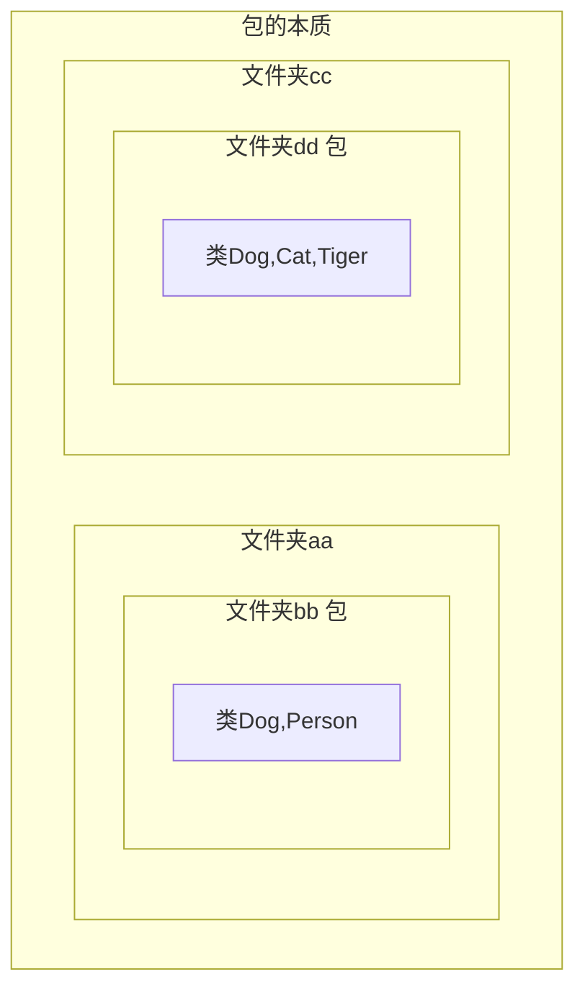

<meta name="viewport" content="width=device-width, initial-scale=1.0, viewport-fit=cover">

[返回](面向对象编程.md)
# 包

- [包](#包)
  - [包的本质](#包的本质)
  - [案例入门](#案例入门)
  - [包的命名](#包的命名)
    - [命名规则](#命名规则)
    - [命名规范](#命名规范)
  - [Java常用的包](#java常用的包)
  - [如何引入包](#如何引入包)
    - [案例](#案例)
  - [使用细节](#使用细节)

## 包的本质
包的本质，实际上就是创建不同的文件夹来保存类文件，示意图如下

- 包的三大作用：
  - 1、区分相同名字的类
  - 2、当类很多时，更好的管理类
  - 3、控制访问范围

- 包的基本语法：
```java
// package：关键字，表示打包
// com.hspedu：表示包名
package come.hspedu;
```



## 案例入门


```java
import com.xiaoqiang.Dog;
public class Text {
    public static void main(String[] args) {
        //使用import导入的包
        Dog dog = new Dog();
        //使用包名来区分包
        com.xiaoming.Dog dog1 = new com.xiaoming.Dog;
    }
}
```
## 包的命名

### 命名规则
只能包含 **数字**、**字母**、**下划线**、**小圆点**， 但<font color="pink">不能以数字开头</font>，不能是关键字或者保留字

```java
demo.class.exec1 // 错误，不能用关键字
demo.12a // 错误，不能以数字开头
demo.ab12.oa // 正确
```

### 命名规范
一般是**小写字母** + **小圆点**  
`come`.公司名.项目名.业务模块名
```java
com.hspedu.oa.model;
com.hspedu.oa.controller;
com.sina.crm.user;//用户模块
com.sina.crm.order;//订单模块
com.sina.crm.utils;//工具类
```

## Java常用的包
一个包下，包含很多类  
```java
java.long.* // long是基本包，默认引入，不需要再引入
java.util.* // util包，系统提供的工具包工具类，使用Scanner
java.net.* // 网络包，网络开发
java.awt.* // 做java界面开发:GUI
```

## 如何引入包
1）第一种：只引入包下的一个类  
```java
import java.util.Scanner;
```
2）第二种：将包下的所有类都引入  
```java
import java.util.*;
```
ps：**最好需要使用哪个类就导入哪个，使用第一种方式**

### 案例
> 用系统提供的`Arrays`完成数组排序
>

```java
import java.util.Arrays;
public class Import01 {
    public static void main(String[] args) {
        int[] arr = {-1,20,2,13,3};
        //对其进行排序
        //传统方法，自动编写排序(冒泡)
        //使用Arrays类
        Arrays.sort(arr);
        for (int i = 0; i < arr.length; i++) {
            System.out.print(arr[i] + "\t");
        }
    }
}
```

## 使用细节
1）`package`的作用声明当前类所在的包，需要放在**类**的最上面，一个类中最多只有**一句package**

```java
// 声明当前类所在的包，需要放在类的最上面
package com.hspedu.pkg;
public class PkgDetial {
    public static void main(String[] args) {
        
    }
}
```
2）`import`指令，位置放在package的下面，在**类定义**前面，可以有多句，没有顺序要求

```java
//导入包
import com.hspedu.pkg;
// 类定义
public class PkgDetail{
    public static void main(String[] args) {
        
    }
}
```