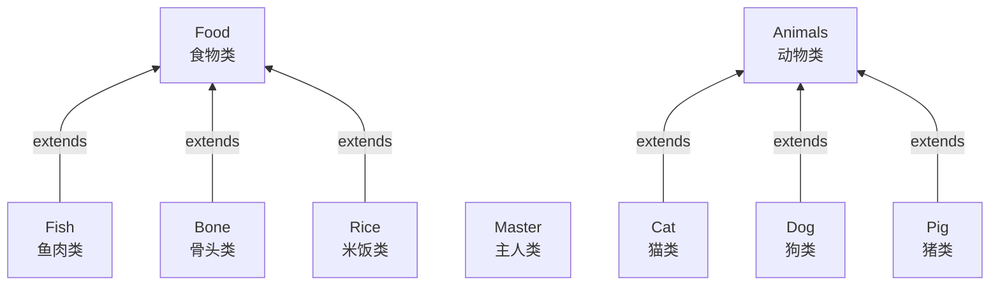
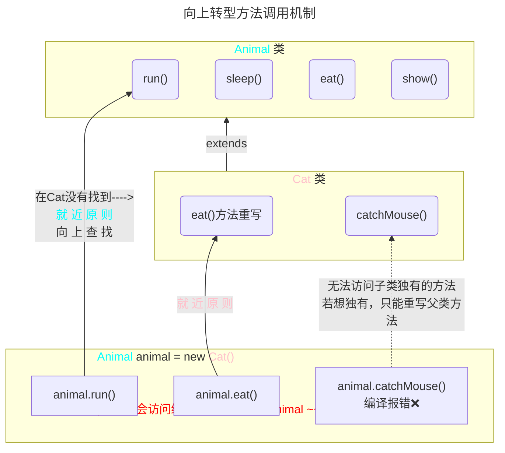
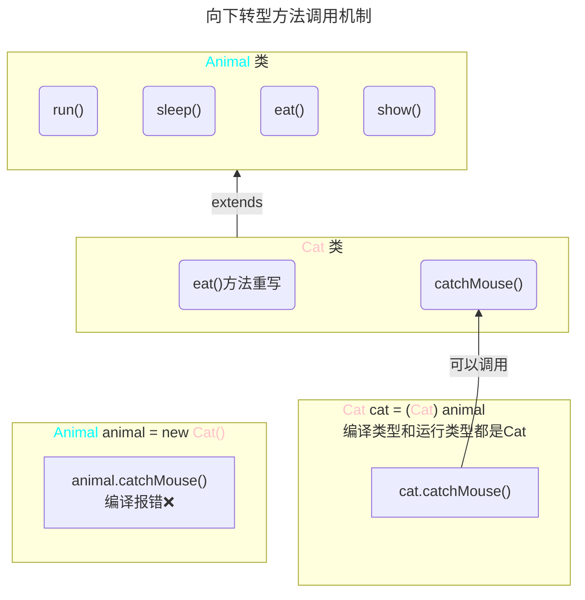

<meta name="viewport" content="width=device-width, initial-scale=1.0, viewport-fit=cover">

[返回](面向对象编程.md)


|[**多态**](多态.md)|[练习题-多态](练习题-多态.md)|[多态的应用](多态的应用.md)|
|:-:|:-:|:-:|


# 多态
$Polymorphic$
- [多态](#多态)
  - [介绍](#介绍)
  - [多态的具体体现](#多态的具体体现)
    - [一、方法的多态](#一方法的多态)
    - [二、对象的多态](#二对象的多态)
  - [案例入门](#案例入门)
  - [使用细节](#使用细节)
    - [一、向上转型](#一向上转型)
    - [二、向下转型](#二向下转型)
    - [属性无重写和instanceOf](#属性无重写和instanceof)
    - [总结](#总结)
  - [动态绑定机制](#动态绑定机制)

## 介绍


传统方法代码复用性不高，不利于代码的维护  

**多态**：指方法或对象的多种形态。是面向对象的第三大特征，多态是建立在封装和继承基础之上的  

## 多态的具体体现  
### 一、方法的多态  
- 方法的重载体现多态：传入同的参数，调用不同的方法
```java
a.sum(10,20);
a.sum(10,20,30)
```
- 方法的重写体现多态：
```java
b extends a
a.say();
b.say();
```
### 二、对象的多态
#⭐ **核心、困难、重点**  

|<font color="#67bfa0">Animal</font>|<font color="#ac70b7">animal</font>|=|<font color="#7088ca">new</font>|<font color="#d4d69a">Dog()</font>|
|:-:|:-:|:-:|:-:|:-:|
|<font color="#67bfa0">编译类型</font>|<font color="#ac70b7">animal</font>|=|<font color="#7088ca">new</font>|<font color="#d4d69a">运行类型</font>|


<font color="pink">1）一个对象的编译类型和运行类型可以不一致</font>   

```java
//animal的编译类型是Animal，运行类型是Dog
//父类的引用animal --指向--> 子类的对象
Animal animal = new Dog();
编译类型 animal = new 运行类型;
```


<font color="pink">2）编译类型在定义对象时，就确定了，不能改变</font>   

<font color="pink">3）运行类型是可以变化的  </font>

```java
Animal animal = new Dog();
//animal的运行类型变成Cat,但编译类型仍为Animal
animal = new Cat();
```

<font color="pink">4）编译类型看定义时 =号 的左边，运行类型看 =号 的右边</font>


案例如下：
```java
package com.poly;

public class Text {
    public static void main(String[] args) {
        //animal 的编译类型是Animal
        //运行类型是Dog;
        Animal animal = new Dog();
        //运行时，执行到该行时，animal的运行类型是Dog，所以是Dog cry
        animal.cry();//小狗汪汪叫

        //animal 编译类型 Animal,运行类型是Cat
        animal = new Cat();
        animal.cry();//小猫喵喵叫
    }
}
```
```java
package com.poly;

public class Animal {
    public void cry() {
        System.out.println("Animal cry() 动物在叫....");
    }
}
```
```java
package com.poly;

public class Cat extends Animal {

    public void cry() {
        System.out.println("Cat cry() 小猫喵喵叫...");
    }
}
```
```java
package com.poly;

public class Dog extends Animal {
    public void cry() {
        System.out.println("Dog cry() 小狗汪汪叫...");
    }
}
```

## 案例入门


> 编写`feed()`方法把左边喂给右边


```java
public class Master {
    //animal 编译类型是Animal，可以指向其子类的对象
    //food 编译类型是Food，可以指向其子类的对象
    public void feed(Animal animal, Food food) {
        System.out.println("主人 " + name + " 给 "
        + animal.getName() + " 吃 " +  food.getName );
    }
}
public Text {
    public static void main(String[] args) {
        //向上转型
        Animal dog = new Dog();
        Food bone = new Bone();
        Master master = new Master();
        master.feed(Animal dog, Food bone);
    }
}
```

## 使用细节

多态的前提：**两个对象(类)存在继承关系**  


### 一、向上转型




[空降](https://www.bilibili.com/video/BV1fh411y7R8?t=348.2&p=310)

1）本质：父类的引用指向了子类的对象  
2）语法：
```java
父类类型 引用名 = new 子类类型();
```
3）特点：  
- 编译类型看左边，运行类型看右边
- 可以调用父类中的**所有成员**(需要遵守访问权限) ；
- 不能调用子类中的**特有成员**；
```java
因为在编译阶段，能调用哪些成员，是由编译类型决定的
```  
- 最终运行效果看子类(**运行类型**)的具体实现

4）**向上转型可隐式发生**

### 二、向下转型



1）语法：
```java
子类类型 引用名 = (子类类型) 父类引用;
```
2）只能强转父类的**引用**，不能强转父类的**对象**  
3）要求**父类的引用**必须指向的是当前**目标类型的对象**  
```java
Animal animal = new Cat();
Cat cat = (Cat) animal;
要求animal原本指向的就是 Cat()
```
4）当向下转型后，可以调用子类型中所有的成员  


### 属性无重写和instanceOf

1）属性没有重写之说——**看编译类型**
```java
public class Text {
    public static void main(String[] args) {
        Base base = new Sub();
        System.out.println(base.count);
        //打印10 即Base，看编译类型
        Sub sub = new Sub();
        System.out.println(sub.count);
        //打印20
    } 
}
```
```java
public Base {
    int count = 10;
}
```
```java
public Sub extends Base {
    int count = 20;
}
```

2）`instancesOf`比较操作符，用于判断对象的**运行类型**是否为XX类或XX类型的子类型

```java
public class Text {
    public static void main(String[] args) {
        BB bb = new BB();
        System.out.println(bb instanceOf BB);//true
        System.out.println(bb instanceOf AA);//true
        //编译AA 运行BB
        AA aa = new BB();
        System.out.println(aa instanceOf AA);//true
        System.out.println(aa instanceOf BB);//true
        Object obj = new Object();
        System.out.println(obj instanceOf AA);//false
    }
}
```
```java
class AA {}
class BB extentds AA {}
```
### 总结

向上转型：**方法看运行类型,属性看编译类型**  
向下转型：**编译类型和运行类型相统一了**

## 动态绑定机制

动态绑定机制：  
1）当调用对象**方法**的时候，该**方法**会和该对象的**内存地址/运行类型**绑定  
2）当调用对象**属性**时，没有动态绑定机制，哪里声明，哪里使用
```java
public class Text {
    public static void main(String[] args) {
        A a = new B();
        System.out.printin(a.sum());//30
        //在A类中执行geti()时，执行的是B类的geti()
    }
}
```

```java
Class A {
    public int i = 10;
    public int sum() {
        return geti() + 10;
    }
    public int sum1() {
        return i + 10;
    }
    public int geti() {
        return i;
    }
}
```
```java
Class B extends A {
    public int i = 20;
    // public int sum() {
    //     return i + 20;
    // }
    public int sum1() {
        return i + 10;
    }
    public int geti() {
        return i;
    }
}
```