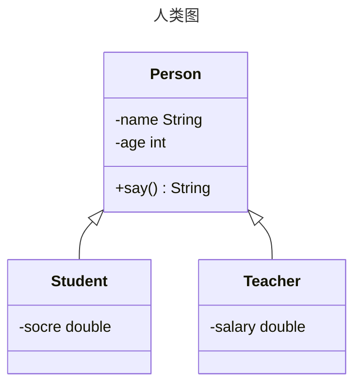

[返回](面向对象编程.md)

|[多态](多态.md)|[练习题-多态](练习题-多态.md)|[**多态的应用**](多态的应用.md)|
|:-:|:-:|:-:|

# 多态的应用

- [多态的应用](#多态的应用)
  - [多态数组](#多态数组)
    - [案例-向上转型](#案例-向上转型)
    - [案例-向下转型](#案例-向下转型)
  - [多态参数](#多态参数)
    - [案例1-喂动物](#案例1-喂动物)
    - [案例2](#案例2)

## 多态数组
[空降]([https://](https://www.bilibili.com/video/BV1fh411y7R8?t=68.8&p=316))

介绍：数组的定义为**父类类型**，里面保存的实际元素类型为**子类类型**
### 案例-向上转型

<center>


</center>

> 继承结构如上，要求创建1个Person对象、2个Student对象和2个Teacher对象，统一放在一个数组中，并调用每个对象的say方法
>


<details>
<summary>Text</summary>

```java
package com.poly.polyarray;

public class Text {
    public static void main(String[] args) {
        Person[] persons = new Person[5];
        persons[0] = new Person("jack", 20);
        persons[1] = new Student("jack", 18, 100);
        persons[2] = new Student("smith", 19, 30.1);
        persons[3] = new Teacher("scott", 30, 20000);
        persons[4] = new Teacher("king", 50, 25000);
        //循环遍历多态数组，调用say方法
        for (int i = 0; i <persons.length; i++) {
            //person[i]编译类型是Person，运行类型根据实际情况变化
            System.out.println(persons[i].say());//动态绑定机制
        }
    }
}
```
</details>

<details><summary>Person</summary>

```java
package com.poly.polyarray;

public class Person {
    private String name;
    private int age;
    public Person(String name, int age) {
        this.name = name;
        this.age = age;
    }

    public String getName() {
        return name;
    }

    public void setName(String name) {
        this.name = name;
    }

    public int getAge() {
        return age;
    }

    public void setAge(int age) {
        this.age = age;
    }
    public String say() {
        return name + "\t" +  age;
    }
}
```
</details>

<details><summary>Teacher</summary>

```java
package com.poly.polyarray;

public class Teacher extends Person{
    private double salary;

    public Teacher(String name, int age, double salary) {
        super(name, age);
        this.salary = salary;
    }

    public double getSalary() {
        return salary;
    }

    public void setSalary(double salary) {
        this.salary = salary;
    }

    @Override
    public String say() {
        return super.say() + " salary=" + salary;
    }
}

```
</details>
<details><summary>Student</summary>

```java
package com.poly.polyarray;

public class Student extends Person{
    private double score;

    public Student(String name, int age, double score) {
        super(name, age);
        this.score = score;
    }

    public double getScore() {
        return score;
    }

    public void setScore(double score) {
        this.score = score;
    }

    @Override
    public String say() {
        return super.say() + " score=" + score;
    }
}
```
</details>

### 案例-向下转型
如果需要调用子类各自**特有方法**


<details><summary>Text</summary>

```java
for (int i = 0; i <persons.length; i++) {
    //person[i]编译类型是Person，运行类型根据实际情况变化
    System.out.println(persons[i].say());//动态绑定机制
    //如何调用老师和学生各自特殊的方法
    if(persons[i] instanceof Student) { //判断Person的运行类型
        ((Student)persons[i]).study();
        // 拆解如下
        // Student student = (Student) persons[i];
        // student.study();
    } else if (persons[i] instanceof Teacher) {
        ((Teacher)persons[i]).teach();
    } else if (persons[i] instanceOf Person) {
        // 做任何处理
    } else {
        System.out.println("类型有误，请自己检查");
    }
}
```
</details>

<details><summary>Teacehr</summary>

```java
//特有方法
public void teach() {
    System.out.println("老师 " + getName() + "正在授课");
}
```
</details>

<details><summary>Student</summary>

```java
//特有方法
public void study() {
    System.out.println("学生 " + getName() + "正在学习...");
}
```
</details>

## 多态参数

**多态参数**：方法定义的**形参类型**为父类类型，**实参类型**允许为子类类型

### 案例1-喂动物
```java
public class Master {
    //animal 编译类型是Animal，可以指向其子类的对象
    //food 编译类型是Food，可以指向其子类的对象
    public void feed(Animal animal, Food food) {
        System.out.println("主人 " + name + " 给 "
        + animal.getName() + " 吃 " +  food.getName );
    }
}
public Text {
    public static void main(String[] args) {
        //向上转型
        Animal dog = new Dog();
        Food bone = new Bone();
        Master master = new Master();
        //多态参数，给狗喂骨头
        master.feed(Animal dog, Food bone);
    }
}
```

### 案例2
`PolyParameter.java`
> 定义员工类**Employee**，包含**姓名**和**月工资**[private]，以及计算年工资**getAnnual**的方法。**普通员工**和**经理**继承了**员工**，经理类多了奖金**bonus**属性和管理**manage**方法，普通员工类多了**work**方法，普通员工和经理类要求分别重写**getAnnual**方法  

> 测试类中添加一个方法**showEmpAnnual(Employee e)**，实现获取任何员工对象的**年工资**，并在**main**方法中调用该方法[**e.getAnnual()**]

> 测试类中添加一个方法，**testWork**，如果是普通员工，则调用**work**方法，如果是经理，则调用**manage**方法
>

<details><summary>Text</summary>

```java
package com.poly.polyparameter;

public class Test {
    public static void main(String[] args) {
        Test test = new Test();

        Employee e1 = new Employee("小天", 1000);
        Employee o1 = new OrdEmployee("大地", 100);
        Employee m1 = new Manager("中宇", 6000, 50000);
        test.showEmpAnnual(e1);
        test.showEmpAnnual(o1);
        test.showEmpAnnual(m1);
        test.testWork(e1);
        test.testWork(o1);
        test.testWork(m1);
    }
    void showEmpAnnual(Employee e) {
        System.out.println(e.getName() + " 的年薪="+ e.getAnnul());
    }
    void testWork(Employee e) {
        if(e instanceof OrdEmployee) {
            ((OrdEmployee) e).work();
        } else if (e instanceof Manager) {
            ((Manager) e).manage();
        } else {
            System.out.println(e.getName() + " 没在工作");
        }
    }
}
```

</details>

<details><summary>Employee</summary>

```java
package com.poly.polyparameter;
public class Employee {
    private String name;
    private double salary;
    public Employee(String name, double salary) {
        this.name = name;
        this.salary = salary;
    }
    public String getName() {
        return name;
    }
    public void setName(String name) {
        this.name = name;
    }
    public double getSalary() {
        return salary;
    }
    public void setSalary(double salary) {
        this.salary = salary;
    }

    public double getAnnul() {
        return 12 * salary;
    }
}
```
</details> 

<details><summary>OrdEmploee</summary>

```java
package com.poly.polyparameter;

public class OrdEmployee extends Employee{
    public OrdEmployee(String name, double salary) {
        super(name, salary);
    }

    public void work() {
        System.out.println("普通员工 "+ getName() + "在工作...");
    }

    @Override
    public double getAnnul() {
        return super.getAnnul();
    }
}
```
</details>

<details><summary>Manager</summary>

```java
package com.poly.polyparameter;

public class Manager extends Employee{
    private double bonus;
    public Manager(String name, double salary, double bonus) {
        super(name, salary);
        this.bonus = bonus;
    }
    public double getBonus() {
        return bonus;
    }
    public void setBonus(double bonus) {
        this.bonus = bonus;
    }

    public void manage() {
        System.out.println("经理 " + getName() + "在管理...");
    }

    @Override
    public double getAnnul() {
        return super.getAnnul() + bonus;
    }
}
```
</details>