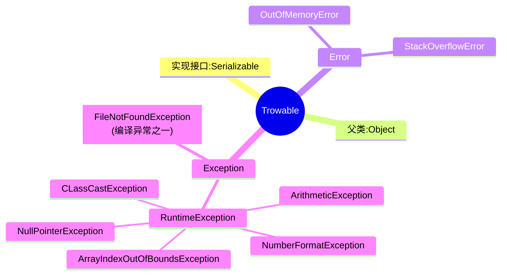

[返回目录](Home.md)


# 异常
- [异常](#异常)
  - [异常的概念](#异常的概念)
  - [**异常体系图**](#异常体系图)
  - [常见的异常](#常见的异常)
    - [1、NullPointerException](#1nullpointerexception)
    - [2、ArithmeticException](#2arithmeticexception)
    - [3、ArrayIndexOutOfBoundsExcepiton](#3arrayindexoutofboundsexcepiton)
    - [4、ClassCastException](#4classcastexception)
    - [5、NumberFormatException](#5numberformatexception)
  - [编译异常](#编译异常)
- [**异常处理**](#异常处理)
  - [try-catch](#try-catch)
    - [基本语法](#基本语法)
    - [使用细节](#使用细节)
    - [练习题](#练习题)
  - [throws](#throws)
    - [介绍](#介绍)
    - [细节](#细节)
    - [区别](#区别)
- [自定义异常](#自定义异常)
  - [案例](#案例)

## 异常的概念

[空降](https://www.bilibili.com/video/BV1fh411y7R8?t=252.3&p=444)
```ditaa
+--------------+    阻止
|  ⭐try-catch |-------------+
+------|-------+             |
       | 使用                |
+------v-------+  导致  +----v-----------+
|某行程序错误  |------->|整个程序停止运行|
+--------------+        +----------------+
```
```java
//使用方法：选中代码块->ctrl + alt + t -> 选中 try-catch
try {
    int res = num1 / num2;
} catch (Exception e) {
    e.printStackTrace();//打印异常信息
}
```

## **异常体系图**

1）异常分为两大类，运行时异常和编译时异常。  
2）**运行时异常**，编译器检查不出来的异常，一般指编程时逻辑错误，是程序员应该避免出现的异常`java.lang.RuntimeException`类以及它的子类都是运行时异常  
3）对于运行时异常，**可以不作处理**，因为这类异常很普遍，若全处理可能会对程序的可读性和运行效率产生影响  
4）**编译时异常**，是编译器要求必须处置的异常
## 常见的异常

### 1、NullPointerException
**空指针异常**  
1）当应用程序试图在需要对象的地方使用`null`时，会抛出该异常
```ditaa
java.lang.Objcet
  |
  +--java.lang.Throwable
      |
      +--java.lang.Exception
          |
          +--java.lang.RuntimeException
```


### 2、ArithmeticException
**数学运算异常**
### 3、ArrayIndexOutOfBoundsExcepiton
**数组下标越界异常**
### 4、ClassCastException
**类型转换异常**  
当试图将对象强制转换为不是实例的子类时，会抛出该异常
```java
public class Test {
  public static void main(String[] args) {
    A b = new B();//向上转型
    B b2 = (B)b;//向下转型
    C c2 = (C)b;//B和C没有关系
    //抛出ClassCastException
  }
}
class A {}
class B extends A {}
class C extends A {}
```
### 5、NumberFormatException
**数字格式不正确异常**  
当应用程序试图将字符串转成一种数值类型，但该字符串不能转换为适当格式时，抛出该异常。**使用该异常我们可以确保输入的是满足条件的数字**
```java
public class Test {
  public static void main(String[] args) {
    String name = "1234";
    //将String转为 int
    int num = Integer.parseInt(name);
    String name = "韩顺平教育";
    //将String转为 int
    int num = Integer.parseInt(name);
    //抛出NumberFormatException
  }
}
```
## 编译异常
编译异常指在编译期间，就必须处理的异常，否则代码不能通过编译

```java
SQLException //操作数据库时，查询表可能发生异常
IOException //操作文件时，发生的异常
FileNotFoundException //当操作一个不存在的文件时，发生异常
ClassNotFoundException //加载类，而该类不存在时，异常
EOFException // 操作文件，到文件末尾，发生异常
IllegalArguementException //参数昇
```
# **异常处理**
基本介绍：异常处理是当异常发生时，对异常处理的的方式

异常处理的方式：  
1）`try-catch-finally`  
程序员在代码中捕获发生的异常，自行处理  
<details><summary>try-catch-finally</summary>

```java
+-try {
|   //代码 /可能有异常
| } catch (Exception e){
|   //发生异常时  :
|   //1）系统将异常封装成 Exception对象e
|   //并传递给 catch
|   //2）得到异常对象后  ，程序员自己处理
|   //3）如果没有发生异常   ，catch代码块不执行
+>} finally {
    //1）不管 try代码块是否有异常发生   ，都会执行
    //2）所以通常将释放资源的代码    ，放在 finally
  }
```
</details>

2）`throws`  
将发生的异常抛出，交给调用者(`方法`)来处理，最顶级的处理者就是`JVM`

<details><summary>throws</summary>

```java
+-->输出异常信息并中断程序
|
|      调用
+JVM-----+
  ^      |
  |      v       调用
  +----main()-----+
 throws  ^        |
         |        v
         +------f1()-----+
          throws ^       |
            |    |       v
            |    +-----f2()
            |   throws 抛出异常
            v
   也可以 try-catch-finally
```

```java
public class  {
  public static void main(String[] args) throws Exception {
    //默认使用throws
  }
}
```

</details>

## try-catch
java提供`try块`和`catch块`来处理异常。`try块`用于包含可能出错的代码，`catch块`用于处理`try块`中发生的异常。可以根据需要在程序中有多个数量的`try-catch块`

### 基本语法
```java
try{
  //可疑代码
  //将异常生成对应的异常对象，传给catch块
} catch(异常对象) {
  //对异常的处理
}
```

### 使用细节
1）如果异常发生了，则异常发生后面的代码不会执行，直接进入到`catch块`  

```java
try {
  String str = "教育 ";
  int a Integer.parseInt(str);//   ----------+
  System.out.println("数字 "+ a);//    跳过该行|
} catch (NumberFormatException e){// <-------+
  System.out.println("异常信息 ="+ e.getMessage());
}
```


2）如果异常没有发生，则顺序执行`try代码块`，不会进到`catch`  
3）如果希望不管是否发生异常，都执行某段代码块(比如关闭连接，释放资源等)，则使用`finally {}`  
4）可以有多个`catch`语句，捕获不同的异常(进行不同的业务处理)，要求父类异常在后，子类异常在前，比如(`Exception`在后，`NullPointerException`在前)

```java
public class Test {
  public static void main(String[] args) {
    try {
      Person person new Person();
      person = null;
      System.out.println("person.getName()");//NullPointerException
      int n1 = 10;
      int n2 = 0;
      int res = n1 / n2;//ArithmeticException
    } catch (NullPointerException e) {//子类写前面
      System.out.println("空指针异常=" + e.getMessage());
    } catch (ArithmeticException e) {
      System.out.println("算数异常=" + e.getMessage());
    } catch (Exception e) {//父类写后面
      System.out.println(e.getMessage());
    } finally {}
  }
}
class Person {
  private String name = "jack";
  public String getName() {
    return name;
  }
}
```

5）可以进行`try-finally`配合，相当于没有捕获异常，程序会**直接崩掉**  
 应用场景：执行一段代码，不管是否发生异常，都必须执行某个业务逻辑
```java
try {
  //代码
} finally {
  //总是执行 
}
```

```java
try {
  int n1 = 10;
  int n2 = 0;
  System.out.println("n1 / n2");
} finally {
  System.out.println("执行了finally");
}
System.out.println("程序继续执行")//不再执行这条语句，程序直接崩掉
```

### 练习题
<details><summary>读程序题:重要</summary>

```java
public class Exception01 {
  public static void main(String[] args) {
    System.out.println(method());
  }
  public static int method() {
    try{
      String[] names = new String[3];
      if (names[1].equals("tom")) { //空指针异常
        System.out.println("names[1]");
      } else {
        names[3] = "hspedu";
      }
      return 1;
    } catch (ArrayIndexOutOfBoundsExcepiton e) {
      return 2;
    } catch (NullPointerException e) {
      return 3;
    } finally {//必须执行，故部执行return 3,而执行return 4
      return 4;
    }
  }
}
//==========第二题==========
public class Exception01 {
  public static int method() {
    int i = 1;
    try{
      i++;
      String[] names = new String[3];
      if (names[1].equals("tom")) { //空指针异常
        System.out.println("names[1]");
      } else {
        names[3] = "hspedu";
      }
      return 1;
    } catch (ArrayIndexOutOfBoundsExcepiton e) {
      return 2;
    } catch (NullPointerException e) {
      return ++i;//return不执行(不返回)，但++i执行
    } finally {
      return ++i; //必须执行
    }
  }
}
//==========第三题==========
public class Exception01 {
  public static int method() {
    int i = 1;
    try{
      i++;
      String[] names = new String[3];
      if (names[1].equals("tom")) { //空指针异常
        System.out.println("names[1]");
      } else {
        names[3] = "hspedu";
      }
      return 1;
    } catch (ArrayIndexOutOfBoundsExcepiton e) {
      return 2;
    } catch (NullPointerException e) {
      return ++i;//i = 3，使用temp保存，执行完finally后返回temp临时变量
    } finally {
      ++i; //必须执行，
      System.out.println("i=" + i);//i=4
    }
  }
}
```
</details>

<details><summary>输入整数判断</summary>

```java
public class Test {
    public static void main(String[] args) {
        Scanner scanner = new Scanner(System.in);
        int num = 0;
        while (true) {
            try {
                System.out.println("请输入一个整数:");
                num = Integer.parseInt(scanner.next());//可能抛出异常
                break;
            } catch (NumberFormatException e) {
                System.out.println("你输入的不是一个整数");
            }
        }
        System.out.println("你输入的值是" + num);
    }
}
```
</details>

## throws
### 介绍
1）如果一个方法(中的语句执行时)可能生成某种异常，但是并不能确定如何处理这种异常，则此方法应**显式地**声明抛出异常，表明该方法**将不对这些异常进行处理**，而由**该方法的调用者**负责处理。


2）在**方法声明中**用`throws语句`可以声明抛出异常的列表，`throw`后面的异常类型可以是方法中产生的**异常类型**，也可以是它的**父类**。  
ps：throws后可以是列表，可以抛出多个异常
```java
public class Throws01 {
  public static void main(String[] args) {
    
  }
  public void f2() throws FileNotFoundException, NullPointerException {
    //让方法的调用者处理异常
    FileInputStream fis = new FileInputStream("d://aa.txt");
  }
}
```

### 细节
1）对于**编译异常**，程序中**必须显式处理**，比如`try-catch`或者`throws`  
2）对于**运行异常**，程序中如果没有处理，**默认就是**`throws`的处理方式  
3）**子类重写父类的方法时**，对抛出异常的规定：子类重写的方法，所抛出的异常类型要么和父类抛出的异常一致，要么为父类抛出的异常的类型的子类型  
```java
class Father {
  public void method() throws RuntimeException {
  }
}
class Son extends Father {
  public void mermaid() throws NullPointerException {

  }
}
```
4）在`throw`过程中，如果有方法`try-catch`，就相当于处理异常，就可以不必`throws`
### 区别

||意义|位置|后面跟的东西|
|:-:|:-:|:-:|:-:|
|`throws`|异常处理的一种方式|方法声明处|异常类型|
|`throw`|**手动生成异常对象**的关键字|方法体中|异常对象|


<details><summary>throw和throws案例</summary>


```
进入方法A
用A方法的finally
制造异常
进入方法B
调用方法B的finally
```

</details>


# 自定义异常

1）自定义异常类：自定义异常类名 (**程序员自己写**) ，继承`Exception`或 `RuntimeException`  

2）如果继承`Exception`，属于**编译异常**  

3）如果继承 RuntimeException，属于**运行异常** (一般来说，继承 `RuntimeException`)

## 案例
> 当我们接收`Person`对象年龄时，要求范围在**18-120**之间，否则抛出一个自定义异常(要求继承`RuntimeException`),并给出提示信息

```java
public class Person {
    public static void main(String[] args) {
        int age = 130;

        if(!(age >= 18 && age <= 120)) {
            //这里可以通过构造器,设置信息
            throw new AgeException("年龄需要在18-120之间");
        }
        System.out.println("你的年龄范围是正确的");
    }
}
//自定义异常
//一般情况把自定义异常做成运行时异常,好处是我们可以使用默认的处理机制
class AgeException extends RuntimeException {
    public AgeException(String message) {
        super(message);
    }
}
```

