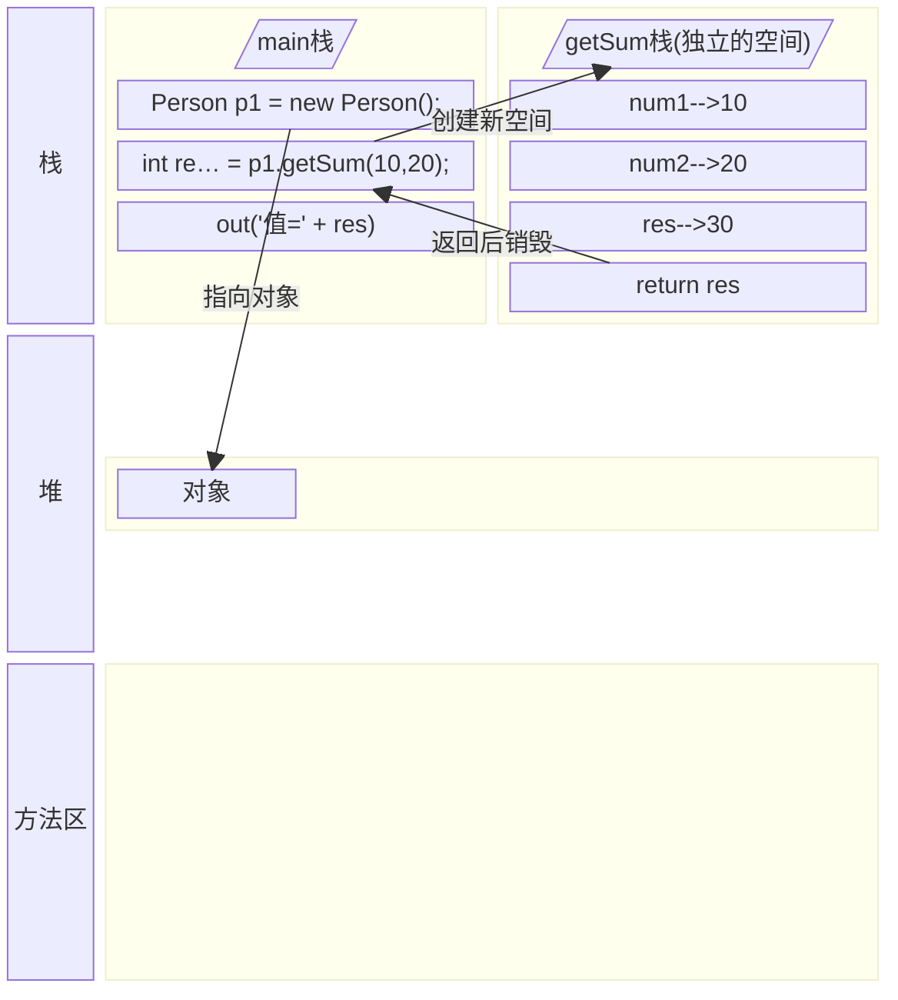

<meta name="viewport" content="width=device-width, initial-scale=1.0, viewport-fit=cover">

[返回](面向对象编程.md)

|[**成员方法**](成员方法.md)|[方法传参机制](成员方法传参机制.md)|[递归](方法递归调用.md)|
|:-:|:-:|:-:|

# 成员方法
- [成员方法](#成员方法)
  - [介绍](#介绍)
  - [成员方法的定义](#成员方法的定义)
  - [方法使用细节](#方法使用细节)
    - [访问修饰符](#访问修饰符)
    - [返回类型](#返回类型)
    - [方法命名](#方法命名)
    - [形参列表](#形参列表)
    - [方法体](#方法体)
    - [**方法调用细节**](#方法调用细节)
  - [案例入门](#案例入门)
  - [**方法调用机制原理**](#方法调用机制原理)
  - [成员方法的应用](#成员方法的应用)

## 介绍
- 基本介绍：在某些情况下，我们需要定义成员方法(简称方法)。比如人类：除了有一些属性外，还有一些行为，如说话、跑步、通过学习，还可以做算数题，这时需要成员方法来实现。

## 成员方法的定义
```java
public 返回数据类型 方法名 (参数列表…) {
    方法主体语句;
    return 返回值;
}
```
- 参数列表：成员方法输入
- 返回数据类型：表示成员方法输出类型，void表示没有返回值
- 方法主体：为了实现某一功能的代码块
- return语句不是必须的

## 方法使用细节
### 访问修饰符
- [ ] [访问修饰符](访问修饰符.md)
- 如果不些写，则默认
### 返回类型
- 1、一个方法最多有**一个返回值**
  - [ ] [方法返回数组](方法返回数组.md)：返回数组可以得到多个值
- 2、返回类型可以为任意类型，包含基本数据类型或引用类型(数组，对象)
- 3、如果方法要求有返回数据类型，则方法体中最后的执行语句必须为`return 值`；而且要求返回值类型必须和return的值类型一致或兼容(自动类型转换)
- 4、如果方法是void，则方法体中可以没有return语句，或者只写`return;`
### 方法命名
- [ ] [小驼峰命名法](小驼峰命名法(简称驼峰法).md)：使用驼峰法，见名知义，表达出功能的含义
### 形参列表
- 1、一个方法可以有0个参数，也可以有多个参数，中间用逗号隔开，比如`getSum(int n1, int n2)`
- 2、参数类型可以为任何类型，包含基本类型或引用类型，如`printArr(int[][] map)`
- 3、调用带参数的方法时，一定对应参数列表传入相同类型或兼容类型的参数
- 4、方法定义时的参数称为**形式参数**；方法调用时传入的参数称为**实际参数**，简称实参，实参和形参的类型要一致或兼容；个数、顺序必须一致
### 方法体
- 里面写完成功能的具体的语句，可以为输入、输出、变量、运算、分支、循环、方法调用、但里面不能再定义方法
  - 即：**方法不能嵌套定义** 
### **方法调用细节**
- 1、同一个类中的方法调用：**直接调用**即可，不需要创建对象，比如print(参数);
- 2、跨类调用：A类调用B类方法，需要通过对象名调用。如`对象名.方法名(参数);`
- 3、特别说明：**跨类的方法调用**和方法的访问修饰符相关

## 案例入门
> 1、添加Speak 成员方法，输出：我是一只好人  
> 2、添加cal01 成员方法，可以计算$~1+…+100~$的结果  
> 3、添加cal02 成员方法，该方法可以接收一个数n，计算$~1+…+n~$的结果
> 4、添加getSum成员方法，可以计算两个数的和

```java
public class Method01 {
    public static void main(String[] args){
        //1、方法写好后，不去调用，不会生效
        //2、创建一个对象，然后调用其方法
        Person p1 = new Person();
        p1.speak(); //调用方法
        p1.cal01();
        p1.cal02(5);//调用cal02方法，把5传给n
        //调用get Sum方法，同时num1 = 10, num2 = 20
        //把getSum 返回的值 赋给变量 returnRes
        int returnRes = p1.getSum(10, 20);
        System.out.println("getSum方法 返回值为" + returnRes);
}
class Person {
    String name;
    int age;
    //1、public 表示方法公开
    //2、void 表示方法没有返回值
    //3、speak 表示方法名 () 表示形参列表 
    //4、{} 方法体
    //5、该方法的作用是输出一句话
    public void speak() {
        System.out.println("我是一个好人");
    }
    public void cal01() {
        int sum = 0;
        for (int i = 1; i <= 100; i++) {
            sum += i;
        }
        System.out.println("sum1=" + sum);
    }
    // (int n) 形参列表，表示当前有一个形参，可以接受用户输入
    public void cal02(int n) {
        int sum = 0;
        for (int i = 1; i <= n; i++) {
            sum += i;
        }
        System.out.println("sum2=" + sum);
    }
    //添加getSum成员方法，可以计算两个数的和
    //1、public表示方法是公开的
    //2、int 表示方法执行后，返回一个int值
    //3、getSum方法名
    //4、(int num1, int num2) 形参列表，2个形参
    //5、return res; 表示把res值返回
    public int getSum(int num1, in num2){
        int res = num1 + num2;
        return res;
    }
}
```
## **方法调用机制原理**

```java
Person p1 = new Person();
int returnRes = p1.getSum(10, 20);
System.out.println("返回值为" + returnRes);
//============
public int getSum(int num1, in num2){
    int res = num1 + num2;
    return res;
}
```




- 1、当程序执行到方法时，就会开辟一个独立的栈空间
- 2、当方法执行完毕，或者执行到return语句时，就会返回
- 3、返回到调用方法的地方
- 4、返回后，继续执行方法后面的代码
- 5、当main方法执行完毕后，整个程序退出

## 成员方法的应用
- 1、遍历数组
```java
public class Method02 {
    public static void main(String[] args) {
        int[][] map = {{0,0,1},{1,1,1},{1,1,3}};
        Mytools tool = new MyTools();
        tool.printArr(map);
    }
}
class MyTools {
    public void printArr(int[][] map){
        for (int i = 0; i < map.length; i++) {
            for (int j = 0; i < map[i].length; j++) {
                System.out.print(map[i][j] + " ");
            }
            System.out.println();
        }
    }
}
```
- 优势
  - 1、提高代码复用性
  - 2、将实现的细节封装起来，然后供其他用户调用即可