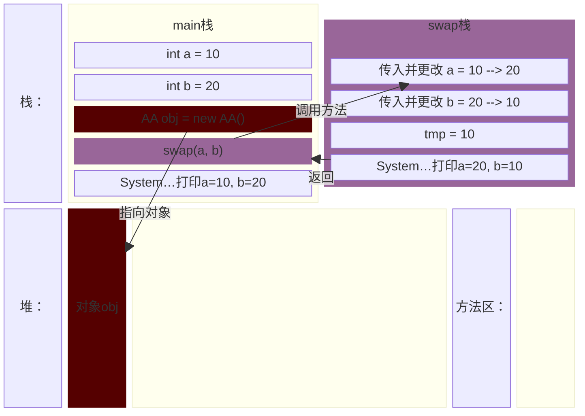
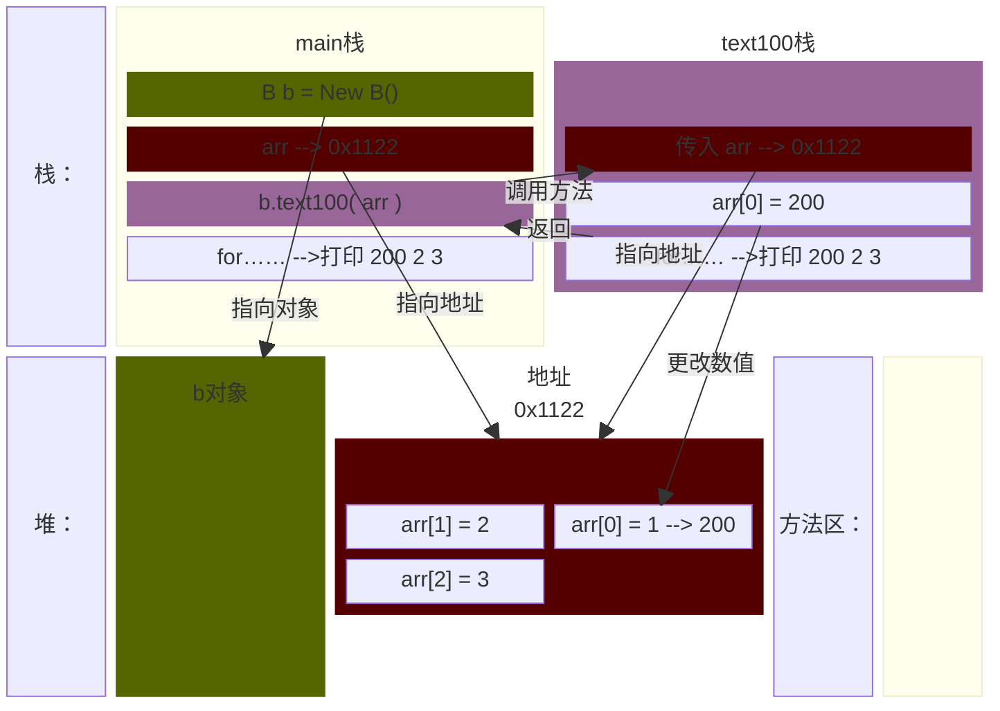
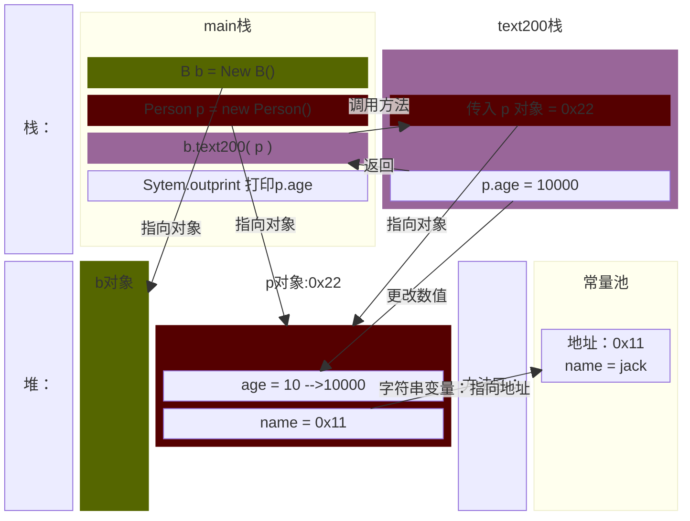
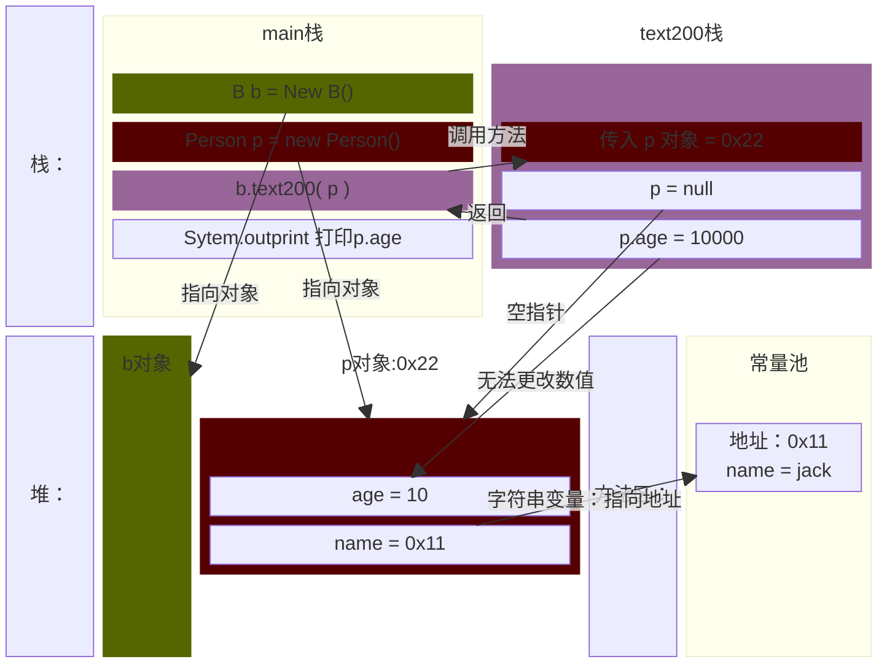
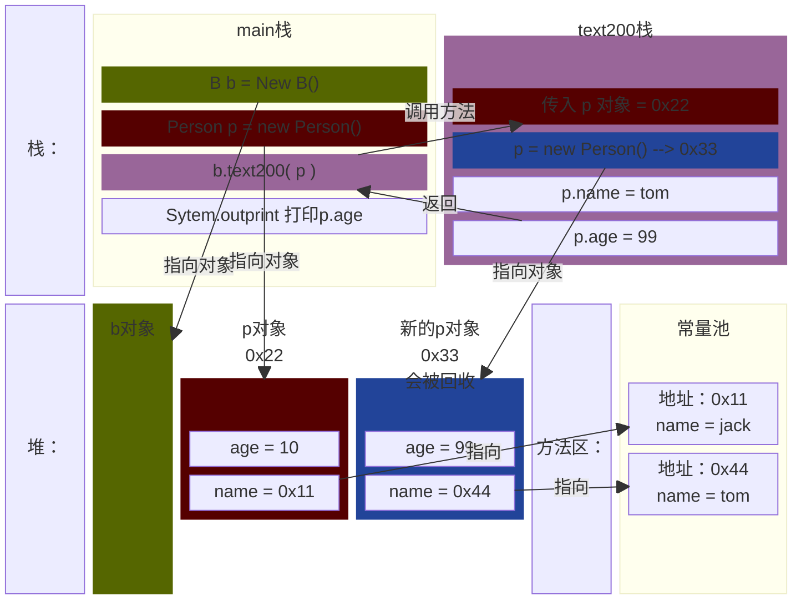

<meta name="viewport" content="width=device-width, initial-scale=1.0, viewport-fit=cover">

[返回](面向对象编程.md)

# 成员方法的传参机制
- [成员方法的传参机制](#成员方法的传参机制)
  - [介绍](#介绍)
  - [值传递机制](#值传递机制)
  - [引用传递机制](#引用传递机制)
    - [传递对象](#传递对象)
    - [空指针](#空指针)
    - [开辟新空间](#开辟新空间)

## 介绍
- 对于编程**非常重要** 
- [空降](https://www.bilibili.com/video/BV1fh411y7R8?t=2.0&p=211)
## 值传递机制
`MethodParameter01.java`
```java
public class MethodParameter01 {
    public static void main(String[] args) {
        int a = 10;
        int b = 20;
        AA obj = new AA();
        obj.swap(a, b);
        //下面这条语句输出什么
        System.out.println("a=" + a + "\tb=" + b);
    }
}
//========
class AA {
    public void swap(int a, int b) {
        int tmp = a;
        a = b;
        b = tmp
        System.out.println("a=" + a + "\tb=" + b);
    }
}
```


- 结论：基本数据数据类型，传递的是值(值拷贝)，形参的任何改变不影响实参。

## 引用传递机制
`MethodParameter01.java`
> B类中编写一方法text100，可以接收一个数组，在方法中修改该数组，看看原来的数组是否变化？  
> B类中编写一个方法text200，可以接受一个Person(age,sal)对象，在方法中修改该对象属性，看看原来的对象是否变化？ 
```java
public class MethodParameter02 {
    public static void main(String[] args) {
        B b = new B();
        int[] arr = {1, 2, 3};
        b.text100(arr); //调用方法
        //遍历main方法中的数组
        System.out.println("main的 arr数组");
        for (int i = 0; i < arr.length; i++) {
            System.out.print(arr[i] + "\t");
        }
        System.out.println();
    }
}
//========
class B {
    public void text100(int []arr) {
        arr[0] = 200;
        //遍历text100中的数组
        System.out.println("text100的 arr数组");
        for (int i = 0; i < arr.length; i++) {
            System.out.print(arr[i] + "\t");
        }
        System.out.println();
    }
}
```

- 结论：引用类型传递的是地址，(传递的也是值，但值是地址)，可以通过形参影响实参

### 传递对象
```java
public class MethodParameter02 {
    public static void main(String[] args) {
        B b = new B();
        Person p = new Person();
        p.name = "jack";
        p.age = 10;

        b.text200(p);
        System.out.println("main 的 p.age=" + p/age)
        //结果肯定是10000
    }
}
class Person {
    String name;
    int age;
}
class B {
    public void test200 (Person p) {
        p.age = 10000;//修改属性
    }
}
```

### 空指针
```java
public class MethodParameter02 {
    public static void main(String[] args) {
        B b = new B();
        Person p = new Person();
        p.name = "jack";
        p.age = 10;

        b.text200(p);
        System.out.println("main 的 p.age=" + p/age)
        //结果为10
    }
}
class Person {
    String name;
    int age;
}
class B {
    public void test200 (Person p) {
        //在此处加入下行
        p = null;
        p.age = 10000;//修改属性
    }
}
```


### 开辟新空间
```java
public class MethodParameter02 {
    public static void main(String[] args) {
        B b = new B();
        Person p = new Person();
        p.name = "jack";
        p.age = 10;

        b.text200(p);
        System.out.println("main 的 p.age=" + p/age)
        //结果仍为10
    }
}
class Person {
    String name;
    int age;
}
class B {
    public void test200 (Person p) {
        //在此处加入下行
        p = new Person();
        p.name = "tom";
        p.age = 99;//修改属性
    }
}
```


