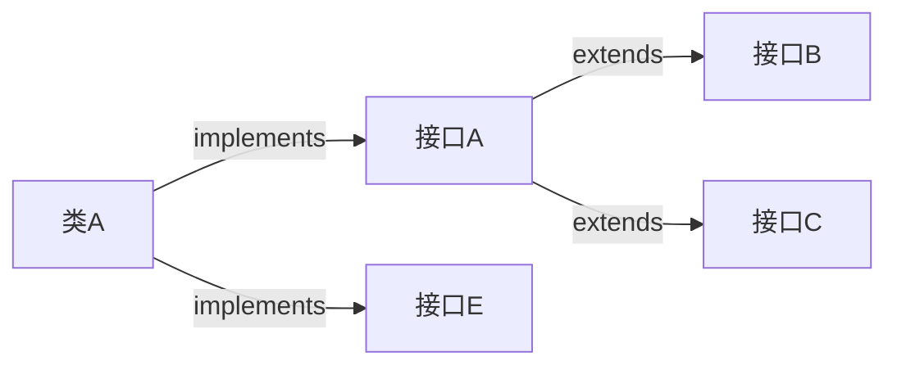

[返回](面向对象编程.md) 

|[**接口**](接口.md)|[接口vs继承](接口vs继承类.md)|[接口的多态](接口的多态.md)|[练习题](练习题-接口.md)|
|:-:|:-:|:-:|-:|


# 接口(interface)
- [接口(interface)](#接口interface)
  - [介绍](#介绍)
  - [应用场景](#应用场景)
  - [使用细节](#使用细节)
  - [案例入门](#案例入门)

## 介绍
接口就是给出一些没有实现的方法，封装到一起，到某个类要使用的时候，在根据具情况把这些方法写出来


```java
interface 接口名 {
    属性
    方法
}
```
```java
class 类名 implements 接口{
    自己属性;
    自己方法;
    必须实现的接口的抽象方法;
}
```
ps：  
1）在jdk7.0及以前，接口里所有的方法都没有方法体，即都是**抽象方法**  
2）在jdk8.0及以后，接口可以有**静态方法**、**默认方法**，也就是说借口中可以有**方法的实现**，但是**需要使用default关键字修饰**  
```java
public interface AA {
    public default void ok() {
        //正确   
    }
    public static void cry() {
        //正确
    }
}
```
3）在接口中，抽象方法可以省略abstract  
4）如果一个类 implements实现接口，需要将该接口的所有抽象方法都实现

## 应用场景

[空降](https://www.bilibili.com/video/BV1fh411y7R8?t=569.0&p=405) 

1）现在要制造战斗机，专家只需要把飞机需要的功能/规格定下来，让别人具体实现   

2）项目经理，管理三个程序员，为了开发一个软件：为了**控制和管理以及规范**软件，项目经理可以定义一些结构，然后由程序员实现  


<details><summary>Test</summary>

```java
public class Test {
    public static void main(String[] args) {
        MysqlDB mysqlDB = new MysqlDB();
        t(mysqlDB);
        OracleDB oracleDB = new OracleDB();
        t(oracleDB);
    }
    public static void t(DBInterface db) {
        db.connect();
        db.close();
    }
}
```
</details> 


<details><summary>DBInterface</summary>

```java
//项目经理写的
public interface DBInterface {
    public void connect();//连接方法
    public void close();//关闭连接方法
}
```
</details>

<details><summary>MysqlDB</summary>

```java
//A程序员
public class MysqlDB implements DBInterface {
    @Override
    public void connect() {
       System.out.println("连接mysql");
    }   
    @Override
    public void close() {
        System.out.println("关闭mysql");
    }
}
```
</details>

<details><summary>OracleDB</summary>

```java
//B程序员写的
public class OracleDB implements DBInterface {
    @Override
    public void connect() {
        System.out.println("连接oracle");
    }
    @Override
    public void close() {
        System.out.println("关闭mysql");
    }
}
```
</details>


## 使用细节

1）接口**不能被实例化**  
2）接口中**所有的方法都是public方法**，接口中的抽象方法，可以不用abstract修饰 
```java
interface IB {
    void hi();
    //等价于：
    public void hi() {}
}
```
3）一个普通类实现接口，就必须将该接口的**所有方法**都实现  
4）**抽象类实现接口**，可以不用实现接口的方法  

5）<font color="pink">一个类同时可以实现多个接口</font>  
```java
class Pig implements IB,IC {}
```

6）**接口中的属性**，只能是final的，而且是`public static final`修饰符  
```java
interface IB {
    int n1 = 10;
    //等价于：
    public static final int n1 = 10;
}
```
7）接口中属性的访问形式：`接口名.属性名`  
8）一个接口不能继承其他的类，但是可以继承多个接口  
```java
interface A extends B,C{}
```


9）接口的修饰符，只能是<font color="pink">public和默认</font>，这点和**类的修饰符是一样的**

补充：
```java
interface A {
    int a = 23;
}
main中
System.out.println(B.a);
//可以直接使用接口中的静态属性
```

## 案例入门

<details><summary>Test</summary>

```java
public class Test {
    public static void main(String[] args) {
        Camera camera = new Camera();
        Phone phone = new Phone(); 
        Computer computer = new Computer();
        computer.work(phone);//把手机接入到计算机
        computer.work(camera);//把相机接入到计算机
    }
}
```
</details>

<details><summary>UsbInterface</summary>

```java
public interface UsbInterface {
    //规定接口的相关方法
    public void start();
    public void stop();
}
```
</details>

<details><summary>Phone</summary>

```java
//Phone 类 实现Usb接口
//Phone 类需要实现 Usb接口 规定/声明的方法
public class Phone implements UsbInterface {
    @override
    public void start() {
        System.out.println("手机开始工作...");
    }
    @override
    public void stop() {
        System.out.println("手机停止工作...")
    }
}
```
</details>

<details><summary>Camera</summary>

```java
public class Camera implements UsbInterface {
    @override
    public void start() {
        System.out.println("相机开始工作...");
    }
    @override
    public void stop() {
        System.out.println("相机停止工作...")
    }
}
```
</details>
<details><summary>Computer</summary>

```java
public class Computer {
    public void work(UsbInterface usbInterface) {
        usbInterface.start();
        usbInterface.stop();
    }
}
```
</details>
