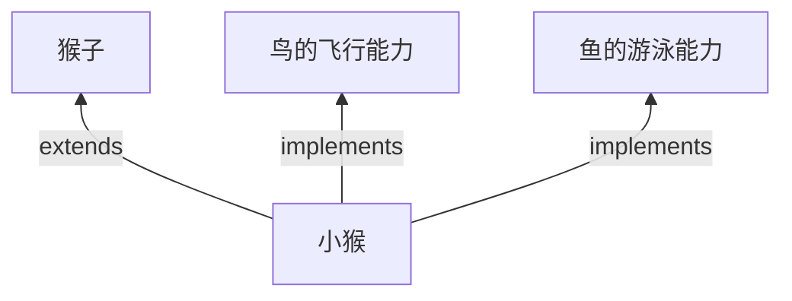

[返回](面向对象编程.md) 

|[接口](接口.md)|[**接口vs继承**](接口vs继承类.md)|[接口的多态](接口的多态.md)|[练习题](练习题-接口.md)|
|:-:|:-:|:-:|-:|

# 接口vs继承类

- [接口vs继承类](#接口vs继承类)
  - [介绍](#介绍)
  - [不同点](#不同点)
    - [1）接口和继承解决的问题不同](#1接口和继承解决的问题不同)
    - [2）接口比继承更加灵活](#2接口比继承更加灵活)
    - [3）接口在一定程度上实现**代码解耦**](#3接口在一定程度上实现代码解耦)

## 介绍 
**实现接口**是对java**单继承机制**的补充 ：  
1）当子类继承了父类，就自动拥有了父类的功能  
2）如果子类需要扩展功能，可以通过实现接口的方式扩展  


```java
public class Test {
    public static void main(String[] args) {
        LittleMonkey wukong =  new LittleMonkey();
        wukong.climbing();
    }
}
```

```java
class Monkey {
    public void climbing() {
        猴子会爬树
    }
}
```

```java
class LittleMonkey extends Monkey implements Birdable,Fishable{
    @Override
    public void flying() {
        System.out.println("像鸟儿一样会飞");
    }
    @Override
    public void swimming() {
        System.out.println("像鱼儿一样会游泳");
    }
}
```
```java
interface Birdable {
    void flying();
}
```
```java
interface Fishable {
    void swimming();
}
```

## 不同点
### 1）接口和继承解决的问题不同
- 继承的价值在于：解决代码的复用性和可维护性  
- 接口的价值在于：设计，设计好各种规范(方法)，让其他类去实现这些方法  
### 2）接口比继承更加灵活
继承是`is-a`关系，接口只需满足`like-a`关系
### 3）接口在一定程度上实现**代码解耦**
即 **接口规范性+动态绑定**