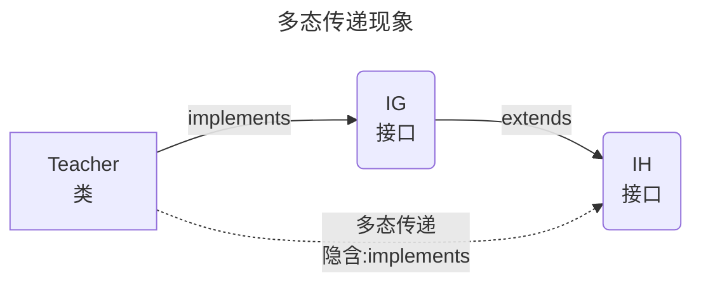

[返回](面向对象编程.md) 

|[接口](接口.md)|[接口vs继承](接口vs继承类.md)|[**接口的多态**](接口的多态.md)|[练习题](练习题-接口.md)|
|:-:|:-:|:-:|-:|


# 接口的多态

- [接口的多态](#接口的多态)
  - [多态参数](#多态参数)
  - [多态数组](#多态数组)
  - [多态传递](#多态传递)

## 多态参数

1）`work(UsbInterface usbInterface)`形参是接口类型  
2）可以接收实现`UsbInterface`接口的类的对象实例
```java
public class Computer {
    public void work(UsbInterface usbInterface) {
        usbInterface.start();
        usbInterface.stop();
    }
}
```
<details><summary>接口实现和继承的比较</summary>

```java
public class Test {
    public static void main(String[] args) {
        //接口的多态
        //接口类型的变量if01可以指向实现了IF接口的类的对象实例
        If if01 = new Monster();
        if01 = new car;
        
        //继承体现多态
        //父类类型的变量a可以指向继承了AAA子类的对象实例
        AAA a = new BBB();
        a = new CCC;
    }
}
interface IF {}
class Monster implements IF {} 
class Car implements IF {}

class AAA {}
class BBB extends AAA {}
class CCC extends AAA {}
```
</details>

## 多态数组

> 案例：给Usb数组中，存放Phone 和 相机对象，Phone类还有一个特有的方法call()  
> 请遍历Usb数组，如果是Phone对象，除了调用Usb接口定义的方法外，还需要调用Phone特有方法call;

<details><summary>案例</summary>

```java
public class Test {
    public static void main(String[] args) {
        //多态数组 ->接口类型的数组
        Usb[] usbs = new Usb[2];
        usbs[0] = new Phone();
        usb2[2] = new Camera(); 

        for (int i = 0; i < usbs.length; i++) {
            usbs[i].work();
            //判断运行类型是phone，进行向下转型
            if (usbs[i] istansceof Phone) {
                ((Phone) usbs[i]).call();
            }
        }   
    }
}
interface Usb {
    void work();
}
class Phone implements Usb {
    public void call() {
        System.out.println("手机可以打电话...");
    }
    @Override
    public void work() {
        System.out.println("手机工作中...");
    }
}
class Camera implements Usb {
    @Override
    public void work() {
        System.out.println("相机工作中...");
    }
}
```
</details>

## 多态传递

```java
public class Test {
    public static void main(String[] args) {
//接口类型的变量可以指向实现了该接口的类的对象实例
        Ig ig = new Teacher();  
        //如果IG extends IH,而Teacher 实现了IG
        //那么，实际上相当于Teacher类也实现了IH接口
        IH ih = new Teacher()
    }
}
```
```java
interface IH {
    void hi();
}
interface IG extends IH{}
class Teacher implements IG {
    @Override
    public void hi () {

    }
}
```
