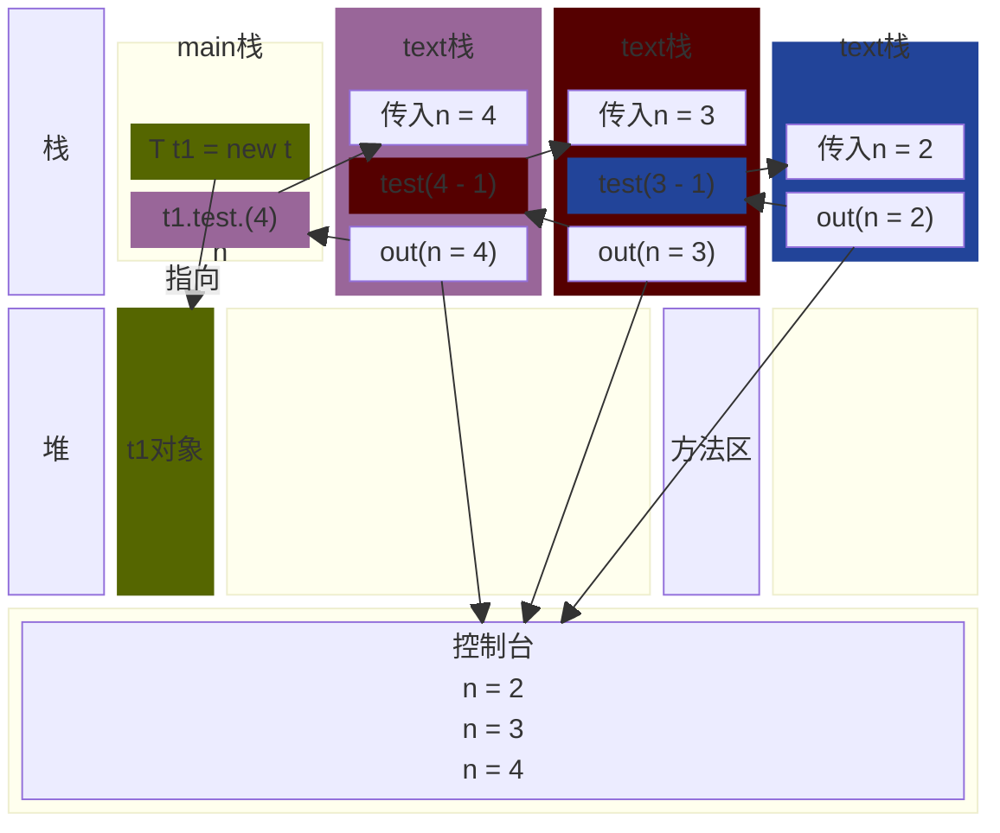
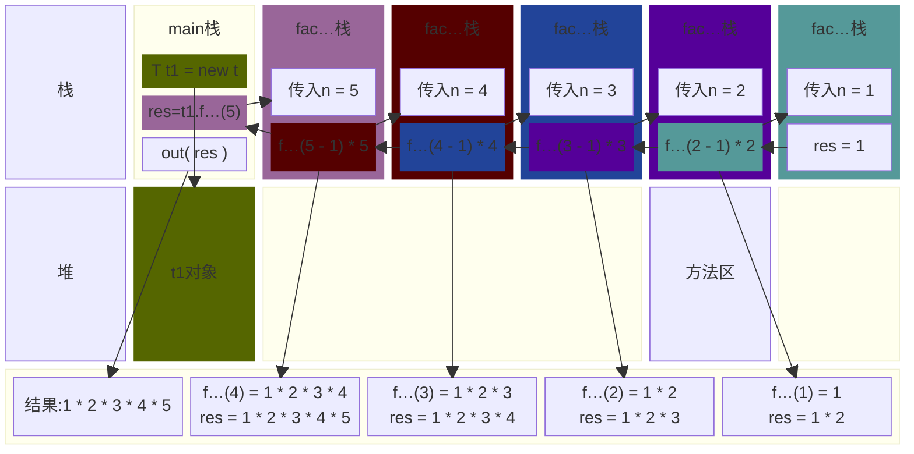

<meta name="viewport" content="width=device-width, initial-scale=1.0, viewport-fit=cover">

[返回](面向对象编程.md)

|[成员方法](成员方法.md)|[方法传参机制](成员方法传参机制.md)|[**递归**](方法递归调用.md)|
|:-:|:-:|:-:|

# 方法递归调用
- [方法递归调用](#方法递归调用)
  - [介绍](#介绍)
  - [案例入门](#案例入门)
    - [逆序打印](#逆序打印)
    - [阶乘](#阶乘)
  - [递归规则](#递归规则)

## 介绍
- 递归是方法自己调用自己，每次调用时传入不同的变量
- 递归有助于编程者解决复杂的问题，同时可以让代码变得简洁
## 案例入门

### 逆序打印
```java
public class Recurison01 {
    public static void main(String[] args) {
        T t1 = new T();
        t1.test(4);//输出什么
    }
}
class T {
    public void test(int n) {
        if (n > 2) {
            test(n - 1);
        }
        System.println("n=" + n);
    }
}
```




### 阶乘
```java
public class Recurison02 {
    public static void main(String[] args) {
        T t1 = new T();
        int res = t1.factorial(5);
        System.out.println("res = " + res);
    }
}
class T {
    public int factorial(int n) {
        if (n == 1) {
            return 1;
        } else {
            return factorial(n - 1) * n;
        }
    }
}
```

## 递归规则
- 1、执行一个方法时，就创建一个新的受保护的独立(栈空间)
- 2、方法的局部变量是独立的，不会相互影响，比如n变量
- 3、如果方法中使用的是引用类型变量(如数组)，就会共享该引用类型
- 4、递归必须向退出递归的条件逼近，否则就是无限递归，出现`StackOverflowError`，死龟了
- 5、当一个方法执行完毕，或者遇到return，就会返回，遵守谁调用，就将结果返回给谁，同时当方法执行完毕或者返回时，该方法也就执行完毕。