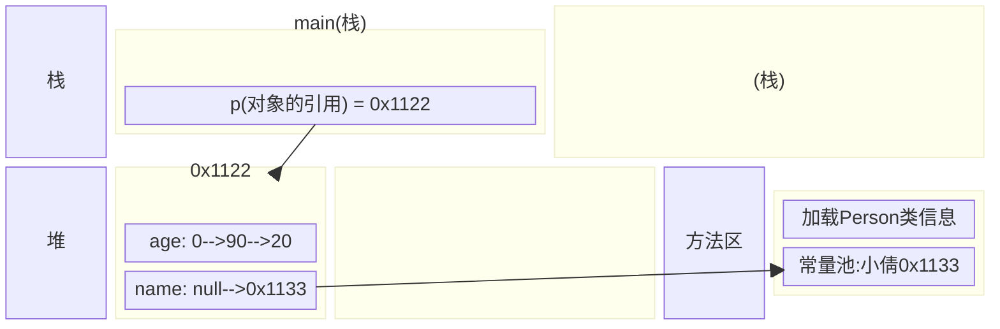

<meta name="viewport" content="width=device-width, initial-scale=1.0, viewport-fit=cover">

[返回](面向对象编程.md)
# 构造器

- [构造器](#构造器)
  - [介绍](#介绍)
  - [使用细节](#使用细节)
  - [案例入门](#案例入门)
  - [对象创建流程分析](#对象创建流程分析)


## 介绍
需求：在创建人类对象时，直接指定这个对象的年龄和姓名，该怎么做  
介绍：构造方法又叫构造器，是类的一种特殊的方法，主要的作用是完成对新对象初始化。它有几个特点：

- 1）方法名和类名相同
- 2）没有返回值
- 3）在创建对象时，系统自动调用该类的构造器完成对对象的初始化

```java
[修饰符] 方法名 (形参列表) {
    方法体;
}
```
- 1）构造器的修饰符可以默认，也可是pubic protected private
- 2）构造器**没有返回值**
- 3）**方法名** 和 **类名字**必须一样 
- 4）**参数列表** 和 **成员方法**一样的规则
- 5）构造器的调用系统完成

## 使用细节

|细节|
|:-|
|1）一个类可以定义多个不同的构造器，即**构造器重载**。<br>比如，可以再给Person类定义一个构造器，用来创建对象的时候，只指定人名，不需要指定年龄 |
|2）构造器名和类名要相同|
|3）构造器**没有返回值**|
|4）构造器是完成对象的初始化，并不是创建对象|
|5）在创建对象时，系统自动调用该类的构造器，不能自己调用|
|6）如果程序员没有定义构造器，系统会自动给类生成一个**默认无参的构造方法**（也叫**默认构造方法**）比如`Person(){}`,使用javap指令，反编译可以查到|
|7）一旦定义了自己的构造器，<font color="pink">默认的构造器就是覆盖了</font>，就**不能再使用默认**的无参构造器了，除非显式的定义一下，即`Person(){}`|


## 案例入门
> 在创建人类对象时，直接指定这个对象的年龄和姓名
>
> `Constructor01.java`
>
```java
public class Constructor01 {
    public static void main(String[] args) {
        //当我们new一个对象时，直接通过构造器指定名字和年龄
        Person p = new Person("smith", 80);
        System.out.println("姓名=" + p.name);
        System.out.println("年龄=" + p.age);
    }
}
class Person {
    String name;
    int age;
    //构造器
    // 1）构造器没有返回值，也不能写void
    // 2）构造器的名称和类Person一样 
    // 3）(String pName, int pAge)是构造器的形参列表，规则和成员方法一样
    public Person(String pName, int pAge) {
        System.out.println("构造器被调用~~，完成对象属性的初始化");
        name = pName;
        age = pAge;
    }
}
```

## 对象创建流程分析
```java
class Person {
    int age =90;
    String name;
    Person (String n, int a) {
        name = n;
        age = a;
    }
}
public class Constructor02 {
    public static void main(String[] args) {
        Person p = new Person("小倩",20);
    }
}
```


- 流程分析
  - 1）加载Person类信息(Person.class)，只会加载一次
  - 2）在堆中分配空间(地址)
  - 3）完成对象初始化
    - 1）默认初始化 age = 0; name = null; 
    - 2）显式初始化 age = 90; name = null
    - 3）构造器初始化 age = 20;
  - 4）把对象在堆中的地址，返回给p(p是对象的引用)