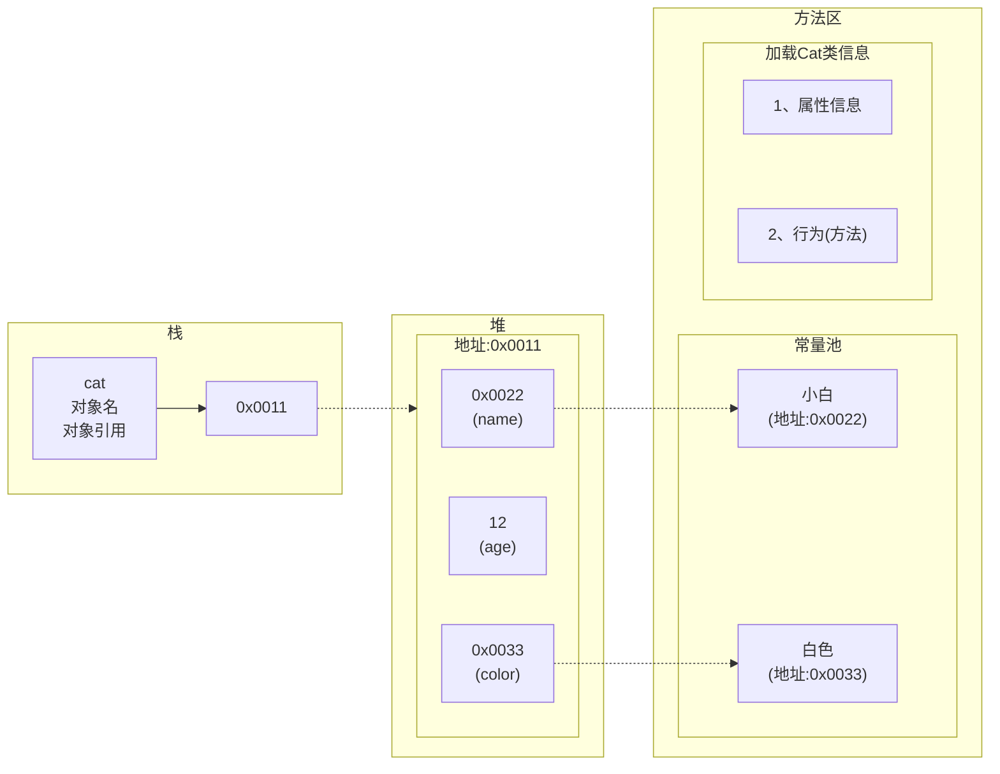

[返回](面向对象编程.md)

# 类与对象

- [类与对象](#类与对象)
	- [问题导入](#问题导入)
	- [类和对象的关系](#类和对象的关系)
	- [案例入门](#案例入门)
	- [**对象在内存中存在形式**](#对象在内存中存在形式)
	- [属性(成员变量)](#属性成员变量)
	- [属性的注意事项](#属性的注意事项)
	- [创建对象与访问属性](#创建对象与访问属性)
		- [先声明再创建](#先声明再创建)
		- [直接创建](#直接创建)
		- [如何访问属性](#如何访问属性)
	- [**类与对象的内存分配机制**](#类与对象的内存分配机制)
	- [类的命名规则](#类的命名规则)


## 问题导入
- [百科](https://www.w3cschool.cn/java/java-object-classes.html) ——[知乎](https://zhuanlan.zhihu.com/p/616498007) 
- [`runoob`](https://www.runoob.com/java/java-object-classes.html)
> 张老太养了两只猫猫：一只名字叫小白.今年3岁，白色。还有一只叫小花，今年100岁，花色。请编写一个程序，当用户输入小猫的名字时，就显示该猫的名字，年龄，颜色。如果用户输入的小猫名错误，则显示 张老太没有这只猫猫。

用变量解决：$~\Longrightarrow~$不利于数据管理，效率低
```java
String cat1Name = "小白";
int cat1Age = 3;
String cat1Color = "白色";

String cat2Name = "小花";
int cat2Age = 100;
String cat2Color = "花色";
```
用数组解决$~\Longrightarrow~$数据类型体现不出来，变量名和内容的对应关系不明确，不能体现毛的行为

## 类和对象的关系


<center>

1、类就是数据类型，如Cat  
2、对象就是一个具体的实例

</center>

- 1、类是抽象的，概念的，代表一类事物
- 2、对象是具体的，实际的，代表一个具体事物
- 3、类是对象的模版，对象是类的一个个体，对应一个实例

## 案例入门

```java
//定义一个猫类(数据类型)
class Cat {
	//属性
	String name;//名称
	int age;//年龄
	String color;//颜色
}
public static void main(){
	//实例化一只猫
	//1、new Cat()创建一只猫
	//2、把创建的猫赋给 cat1
	Cat cat1 = new Cat();
	cat1.name = "小白";
	cat1.age = "3";
	cat1.color = "白色";
	//创建第二只猫
	Cat cat2 = new Cat();
	cat1.name = "小花";
	cat1.age = "100";
	cat1.color = "花色";
	//访问对象的属性
	System.out.println("第一只猫的信息" + cat1.name + " "
	+ cat1.name + " " + cat1.name+ " ");
	System.out.println("第二只猫的信息" + cat2.name + " "
	+ cat2.name + " " + cat2.name+ " ");
}
```


## **对象在内存中存在形式**

```java
Cat cat = new Cat();
cat.name = "小白";
cat.age = 12;
cat.color = "白色";
```


## 属性(成员变量)
- 1、概念(叫法)：成员变量 = **属性** = field(字段)
  - 成员变量用来表示属性
- 2、属性是类的一个组成部分，一般是**基本数据类型**，也可是**引用数据类型(对象,数组)**。
  - `int age` 就是属性
```java
class Car{
	String name;//属性，成员变量，字段field
	double price;
	String color;
	String[] master;//属性可以是基本数据类型，也可是引用数据类型
}
```

## 属性的注意事项
- 1、属性的定义语法同变量
  - [ ] [访问修饰符](访问修饰符) 属性类型 属性名;
- 2、属性的定义类型可以为任意类型，包含基本类型或引用类型
- 3、属性如果不赋值，有默认值，规则和数组一样
  - ps: [数组](数组.md#使用细节)

<center>

|int|short|byte|long|float|double|
|:-:|:-:|:-:|:-:|:-:|:-:|
|0|0|0|0|0.0|0.0|

|char|boolean|String|
|:-:|:-:|:-:|
|\u0000|false|null|
</center>

```java
//创建Person对象
//p1是对象名
//new Person() 创建的对象空间才是真正的对象
Person p1 = new Person();
//对象属性根据规则自动分配
class Person{
	int age;
	String name;
	double sal;
	boolean isPass;
}
```
## 创建对象与访问属性

### 先声明再创建
```java
Cat cat;//声明对象cat
cat = new Cat();//创建 开辟空间，将空间地址填回cat
```
### 直接创建 
```java
Cat cat = new Cat();
```
### 如何访问属性
```java
对象名.属性名;
cat.name;
cat.age;
cat.color;
```
## **类与对象的内存分配机制**
```java
//定义一个人类(Person)包括名字年龄
Person p1 = new Person();
p1.age = 10;
p1.name = "小明";

Person p2 = p1;//p1赋给了p2 让p2指向p1
System.out.println(p2.age);
```


- Java内存结构分析：
  - 1、栈：一般存放基本数据类型(局部变量)
  - 2、堆：存放对象(Cat cat, 数组等)
  - 3、方法区：常量池(常量，比如字符串)，类加载信息
```java
Person p = new Person();
p1.name = "jack";
p1.age = 10;
```
- 创建对象流程分析：
  - 1、先加载Person类信息(属性和方法信息，只会加载一次)
  - 2、在堆中分配空间，进行默认初始化，把堆中的地址赋给p，p就指向对象
  - 3、把地址赋给p，p就指向对象
  - 4、进行指定初始化 `p.name = "jack"; p.age = 10;`
## 类的命名规则
- 类名应以下划线`_`或字母开头，最好以字母开头
- 第一个字母最好是大写，如果类名由多个单词组成，则每个单词的首字母最好都大写
- 类名不能为Java中的关键字
- 类名不能包含任何**嵌入的空格**和**点号**以及除了**下划线**`_`和**美元符号**`$`之外的特殊字符
