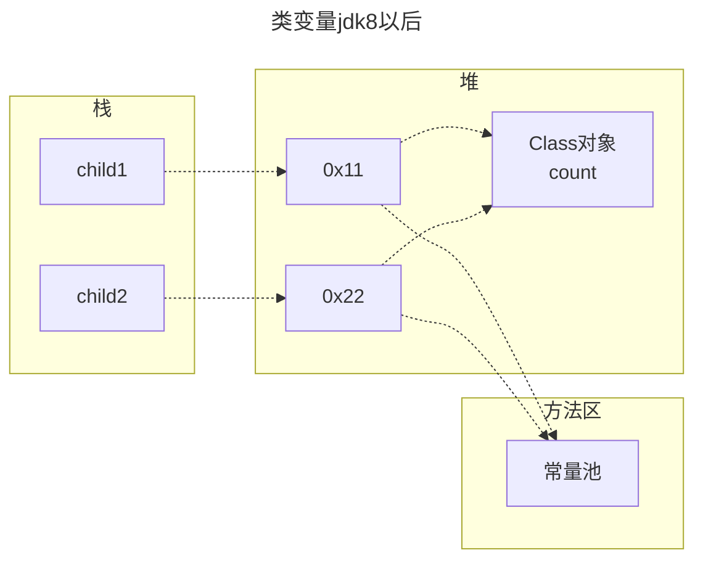
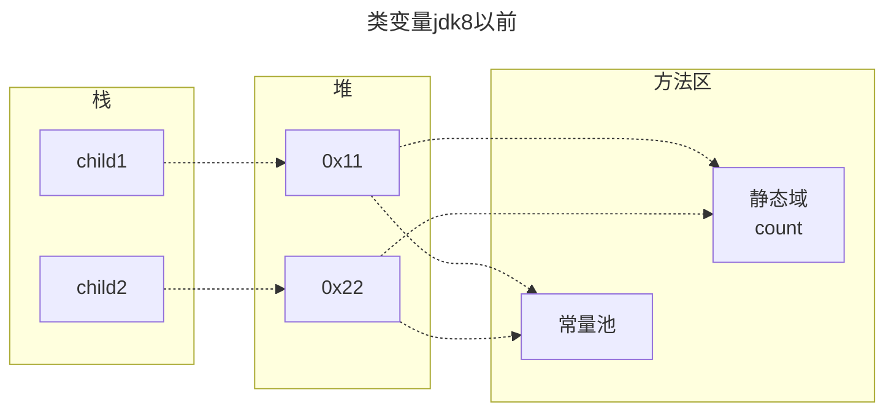

<meta name="viewport" content="width=device-width, initial-scale=1.0, viewport-fit=cover">

[返回](面向对象编程.md)

|[**类变量**](类变量和类方法.md)|[类方法](类方法.md)|
|:-:|:-:|
||||


# 类变量

[空降](https://www.bilibili.com/video/BV1fh411y7R8?t=473.5&p=374)


- [类变量](#类变量)
  - [介绍](#介绍)
    - [如何定义类变量](#如何定义类变量)
    - [如何访问类变量](#如何访问类变量)
  - [使用细节](#使用细节)
  - [案例入门](#案例入门)
  - [内存布局](#内存布局)

## 介绍

类变量也叫静态变量/静态属性，是该类所有对象共享的变量，任何一个该类的对象去访问它时，取到的都是相同的值；  
同样的，任何一个该类的对象去修改它时，修改的也是同一个变量

### 如何定义类变量

```java
访问修饰符 static 数据类型 变量名; [推荐]
static 访问修饰符 数据类型 变量名;
```
静态变量的**访问修饰符**的访问权限和范围 和普通属性是一样的
### 如何访问类变量

```java
类名.类变量名 [推荐]
对象名.类变量名
```
```java
public class Test {
    public static void main(String[] args) {
        //类变量是随类的加载而创建的，所没有没有创建对象实例也可以访问
        System.out.println(A.name);
        A a = new A();
        System.out.println(a.name);
    }
}
class A {
    // 类变量的访问，必须遵守 相关的访问权限
    public static String name = "韩顺平教育";
}
```

## 使用细节
1）什么时候需要使用类变量：  
当需要让某个类的所有对象**共享一个变量**时，考虑使用：如，定义一个学生类，统计所有学生共交多少钱

2）类变量和实例变量的区别：  
实例变量是每个对象共享，类变量是该类的所有对象共享  

3）加上**static**称为类变量或静态变量，否则称为实例变量/普通变量/非静态变量

4）类变量可以通过 `类名.类变量名`或者`对象名.类变量名`来访问，推荐使用**前者**   （ps：需要满足访问权限）  

5）实例变量不能通过`类名.类变量名`的方式访问

6）类变量是在加载类时就初始化了，也就是说，没有创建对象，只要类加载了，就可以使用类变量了

7）类变量的生命周期是随类加载开始，随类消亡而销毁
## 案例入门
> 设计一个`int count`表示总人数，我们在创建一个小孩时，就把count加1，并且count是所有对象共享的就ok了！，我们使用类变量来解决ChildGame.java改
>

<details><summary>Test</summary>

```java
public class Test {
    public static void main(String[] args) {
        Child child1 = new Child("白骨精");
        child1.join();
        child.count++;

        Child child2 = new Child("狐狸精");
        child2.join();
        child.count++;

        //  也可以随便一个child1(或2).count 类变量可以用类名访问
        System.out.println("共有" + Child.count +"个小孩加入了游戏...");
    }
}
```
</details>

<details><summary>Child</summary>


```java
class Child {
    private String name;
    //定义一个静态变量 cout，是一个类变量(静态变量)
    //该变量最大的特点就是会被Child类所有的对象实例共享
    public static int count = 0; 
    public Child(String name) {
        this.name = name;
    }
    public void join() {
        System.out.println(name + "加入了游戏...");
    }
}
```
</details>

## 内存布局

```java
class Child {
    private String name;
    //定义一个静态变量 cout，是一个类变量(静态变量)
    //该变量最大的特点就是会被Child类所有的对象实例共享
    public static int count = 0; 
    public Child(String name) {
        this.name = name;
    }
    public void join() {
        System.out.println(name + "加入了游戏...");
    }
}
```






1）类变量是同一个类所有对象共享的  
2）类变量是在类加载的时候就生成了。