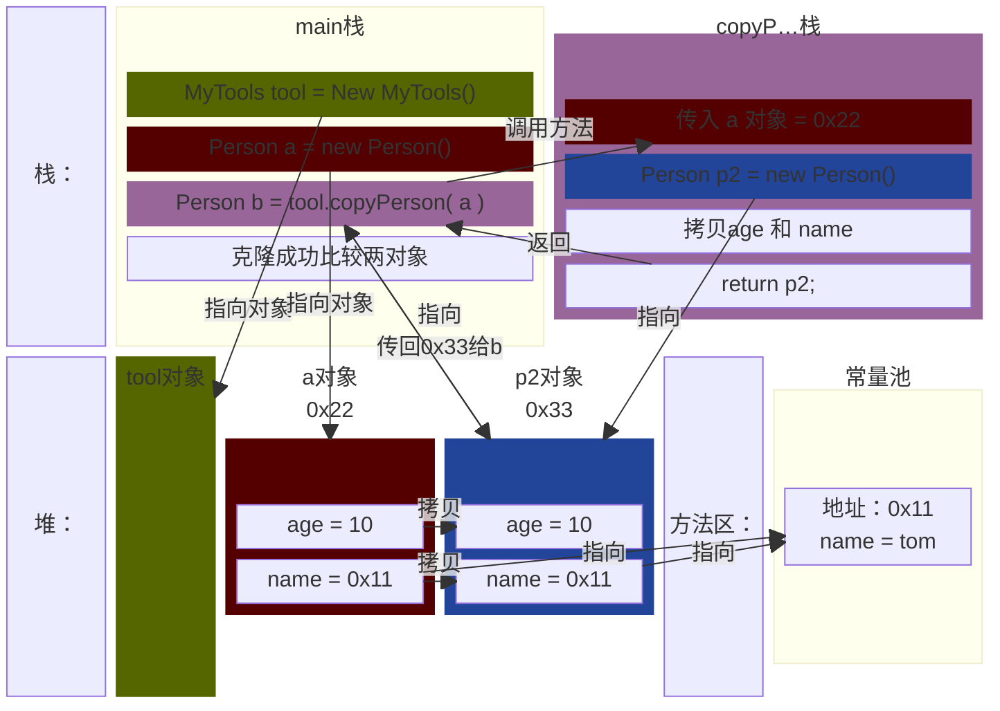

[返回](练习题.md)

- [空降](https://www.bilibili.com/video/BV1fh411y7R8?t=1.3&p=214)
### 第一题
> 编写类MyTools，编写一个方法可以打印二维数组的数据
> `MethodExercise02.java`

```java
public class MethodExercise03 {
    public static void main(String[] args) {
        int arr[][] = {{3,1,3},{1,2,1},{1,5,6}};
        MyTools tool = new MyTools();
        tool.printArr(arr);
    }
}
class MyTools {
    public void printArr(int arr[][]) {
        for (int i = 0; i < arr.length; i++) {
            for (int j = 0; j < arr[i].length; j++) {
                System.out.print(arr[i][j] + "\t");
            }
            System.out.println();
        }
    }
}
```

### 第二题
> 编写一个方法copyPerson，可以复制一个Person对象，返回复制的对象。克隆对象，注意要求得到的新对象和原来的对象是两个独立的对象，只是他们的属性相同。

```java
public class MethodExercise05 {
    public static void main(String[] args) {
        //定义用来当工具的对象
        MyTools tool = new MyTools();
        //定义原对象
        Person a = new Person();
        a.age = 10;
        a.name = "tom";
        //克隆对象
        Person b = tool.copyPerson(a);
        //比对两个对象
        System.out.println("a的属性 age=" + a.age + " name=" + a.name);
        System.out.println("b的属性 age=" + b.age + " name=" + b.name);
        //输出对象的hashCode来看对象是否是同一个
        System.out.println("a的hashCode是" + a.hashCode());
        System.out.println("b的hashCode是" + b.hashCode());
    }
}
class Person {
    int age;
    String name;
}
class MyTools {
    //1、方法返回类型 Person 
    //2、方法的名字 copyPerson
    //3、方法的形参 (Person p)
    //4、方法体 创建一个新对象，并复制属性，返回即可
    public Person copyPerson(Person p) {
        // 创建一个新对象
        Person p2 = new Person();
        p2.age = p.age;
        p2.name = p.name;
        return p2;
    }
}
```


- tom字符串的解释详见——**String的不可变性**