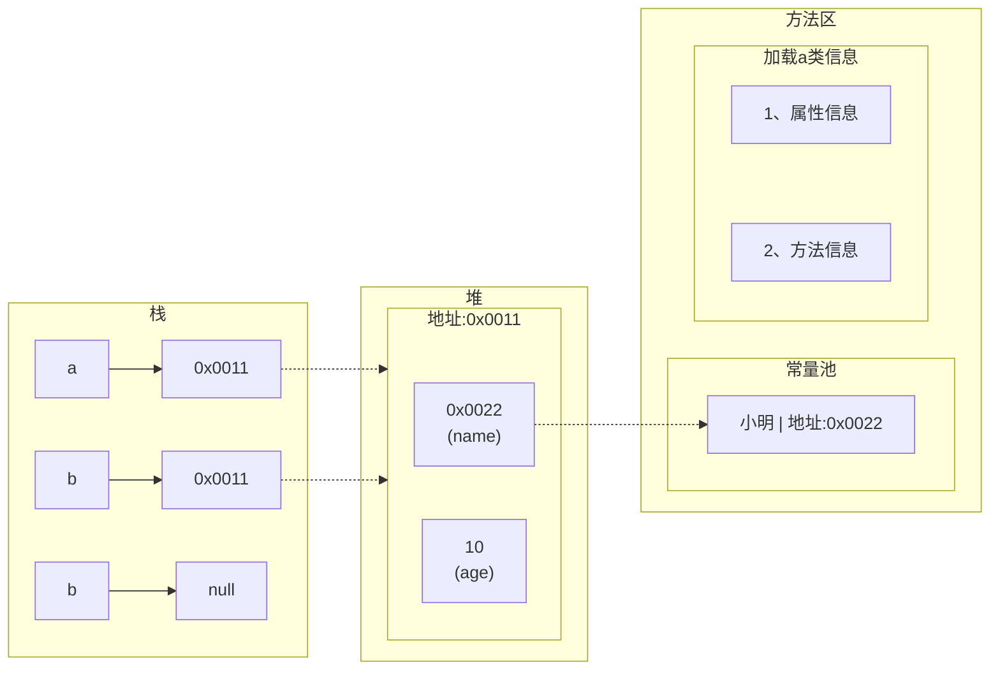

[返回](练习题.md)

#### 第一题、读代码
```java
Person a = new Person();
a.age = 10;
a.name = "小明";
Person b;
b = a;
System.out.println(b.name);//小明
b.age = 200;
b = null;
System.out.println(a.age);//200
System.out.println(b.age);//空指针异常
```
