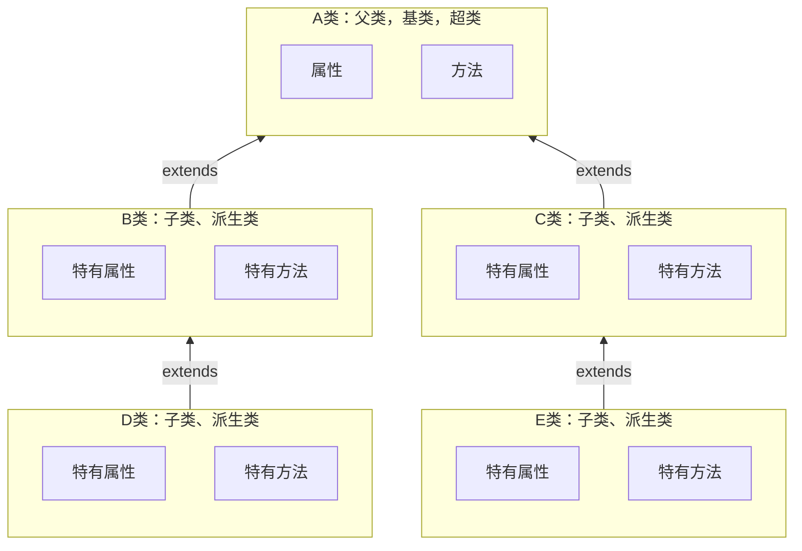

[返回](面向对象编程.md)

# 继承
- [继承](#继承)
  - [介绍](#介绍)
  - [基本语法](#基本语法)
  - [使用细节](#使用细节)
  - [案例入门](#案例入门)

## 介绍 

继承可以解决代码复用问题，让我们的变成更加接近人类思维，当多个类存在相同的**属性**(变量)和**方法**时，可以从这些类中抽象出父类，在父类中定义这些相同的属性和方法，所有的子类不需要重新定义这些属性和方法，只需要通过<font color="pink">extends</font>来声明继承父类即可



## 基本语法

```java
class 子类 extends 父类 {
}
```
1）子类就会自动拥有父类定义的属性和方法  
2）父类又叫超类、基类  
3）子类又叫派生类  

继承可以：  
1）提高代码复用性  
2）提高代码扩展性和维护性

## 使用细节

|访问级别|访问控制修饰符|**本类**|同包|子类|不同包|
|:-:|:-:|:-:|:-:|:-:|:-:|
|公开|**public**|✅|✅|✅|✅|
|受保护|**protected**|✅|✅|✅|❌|
|默认|**无修饰符**|✅|✅|❌|❌|
|私有|**private**|✅|❌|❌|❌|

1）子类继承父类所有的属性和方法，但私有属性和方法**不能在子类中直接访问**，要通过**公共**(<font color="pink">父类提供的</font>)的方法去访问，而非私有的可以在子类直接访问

## 案例入门

> 编写两个类，一个是Pupil类(小学生)，一个是Graduate(大学毕业生).
> 问题：两个类的属性和方法有很多是相同的，怎么办


```java
package com.extend;

//父类，Pupil和Graduate的父类
public class Student {
    //共有属性
    public String name;//姓名
    public int age;//年龄
    private double score;//成绩

    //共有方法
    public void setScore(double score) {
        this.score = score;
    }
    public void showInfo() {
        System.out.println("学生名=" + name + " 年龄=" + " 成绩=" + score);
    }
}
```
```java
package com.extend;

//Graduate 继承 Student
public class Graduate extends Student{
    public void testing() {
        System.out.println("大学生" + name + "正在考大学数学...");
    }
}
```
```java
package com.extend;

//Pupil 继承 Student
public class Pupil extends Student {
    public void testing() {
        System.out.println("小学生" + name + "正在考小学数学...");
    }
}
```