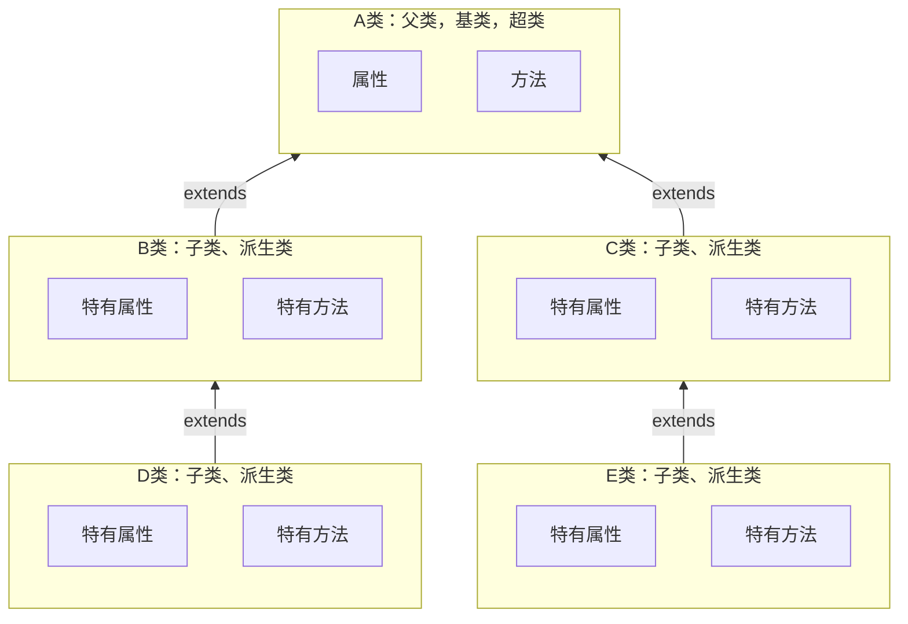
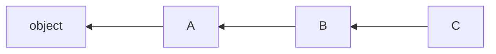
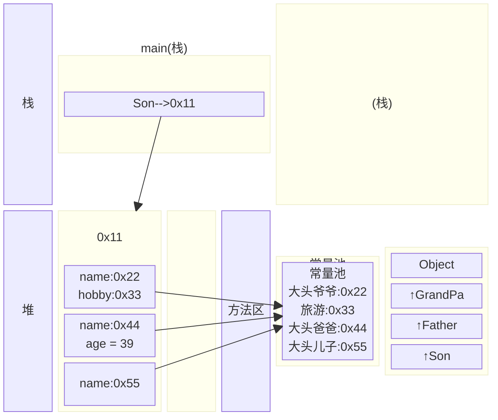
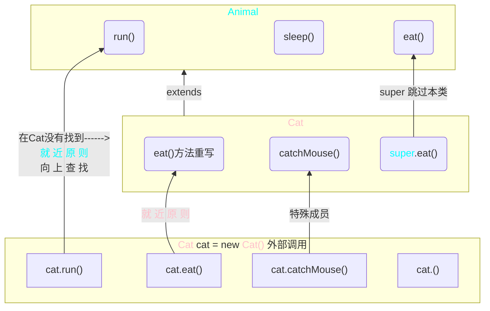

[返回](面向对象编程.md)

# 继承
- [继承](#继承)
  - [介绍](#介绍)
  - [基本语法](#基本语法)
  - [**使用细节**](#使用细节)
  - [案例入门](#案例入门)
  - [继承的内存本质](#继承的内存本质)

## 介绍 

继承可以解决代码复用问题，让我们的变成更加接近人类思维，当多个类存在相同的**属性**(变量)和**方法**时，可以从这些类中抽象出父类，在父类中定义这些相同的属性和方法，所有的子类不需要重新定义这些属性和方法，只需要通过<font color="pink">extends</font>来声明继承父类即可



## 基本语法

```java
class 子类 extends 父类 {
}
```
1）子类就会自动拥有父类定义的属性和方法  
2）父类又叫超类、基类  
3）子类又叫派生类  

继承可以：  
1）提高代码复用性  
2）提高代码扩展性和维护性

## **使用细节**

|访问级别|访问控制修饰符|**本类**|同包|子类|不同包|
|:-:|:-:|:-:|:-:|:-:|:-:|
|公开|**public**|✅|✅|✅|✅|
|受保护|**protected**|✅|✅|✅|❌|
|默认|**无修饰符**|✅|✅|❌|❌|
|私有|**private**|✅|❌|❌|❌|

1）子类继承父类所有的属性和方法，但私有属性和方法**不能在子类中直接访问**，要通过**公共**(<font color="pink">父类提供的</font>)**的方法**去访问，而非私有的属性和方法可以在子类直接访问  

2）子类**必须**调用**父类的构造器**，完成父类的初始化：创建子类时，会先调用Base()，再调用Sub()

```java
class Base {
    public Base() {
        super();//父类仍有隐藏的super
    }
}
class Sub extends Base {
    public Sub() {
        super();//隐藏内容，默认调用父类无参构造器
    }
}
```
3）当创建子类对象时，不管使用子类的哪个构造器，**默认情况下总会去调用父类的无参构造器**；<font color="pink">如果父类没有提供无参构造器</font>，则必须在子类的构造器中用**super**去指定使用**父类的哪个构造器**完成对父类的初始化，否则，编译不会通过 #⭐

```java
class Base {
    String name;
    public Base(String name) {} //父类没有无参构造器
}
class Sub extends Base {
    public Sub() {
        super("smith") //必须指定使用父类的哪个构造器
    }
}
```
4）如果希望指定去调用父类的某个构造器，则需显式的调用一下：`super(参数列表)`
```java
class Sub {
    public Sub(String name, int age){
        super(); //调用父类的无参构造器，也可以什么都不写
        super(name, age);//调用父另一个构造器
    }
}
class Base {
    String name;
    int age;
    public Base(){}
    public Base(String name, int age) {}
}
```
5）`super()`只能在**构造器**中使用，不能在成员方法中使用。且`super()`在使用时，必须放在**构造器第一条语句**   

6）`super()`和`this()`都只能放在构造器第一行，因此这两个方法**不能共存**于同一个**构造器**

7）Java所有类都是**Object类**的子类，**Object类**是所有类的基类

8）父类构造器的调用不限于直接父类，将一直追溯直到**Object类**(顶级父类)



9）子类最多只能继承一个父类(直接继承)，即java是**单继承机制**

10）不能滥用继承，子类和父类之间必须满足<font color="pink">is-a</font>的逻辑关系

- [练习题-继承](练习题-继承.md)
## 案例入门


> 编写两个类，一个是Pupil类(小学生)，一个是Graduate(大学毕业生).
> 问题：两个类的属性和方法有很多是相同的，怎么办


```java
package com.extend;

//父类，Pupil和Graduate的父类
public class Student {
    //共有属性
    public String name;//姓名
    public int age;//年龄
    private double score;//成绩

    //共有方法
    public void setScore(double score) {
        this.score = score;
    }
    public void showInfo() {
        System.out.println("学生名=" + name + " 年龄=" + " 成绩=" + score);
    }
}
```
```java
package com.extend;

//Graduate 继承 Student
public class Graduate extends Student{
    public void testing() {
        System.out.println("大学生" + name + "正在考大学数学...");
    }
}
```
```java
package com.extend;

//Pupil 继承 Student
public class Pupil extends Student {
    public void testing() {
        System.out.println("小学生" + name + "正在考小学数学...");
    }
}
```

## 继承的内存本质

```java
public class ExtendsTheory {
    public static void main(String[] args) {
        Son son = new Son();
        //内存布局
        //要按照查找关系来返回信息
        //1）首先看子类是否有该属性
        //2）如果有子类并且可以访问，则返回其信息，有但不可访问就报错
        //3）如果子类没有这个属性，就看父类有没有这个属性，
        //如果父类有该属性，并且可以访问，就返回信息
        //4）如果父类没有，就按照3）的规则继续找上级父类，都没有就报错
        System.out.println(son.name);//返回大头儿子
        System.out.println(son.age);//返回39
        System.out.println(son.hobby);//返回旅游
    }
}
class GrandPa {
    String name = "大头爷爷";
    String hobby = "旅游";
}
class Father extends GrandPa {
    String name = "大头爸爸";
    int age = 39;
}
class Son extends Father {
    String name = "大头儿子";
}
```





<center> 
<font color="pink">子类成员继承关系图</font>


</center>