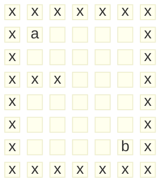

<meta name="viewport" content="width=device-width, initial-scale=1.0, viewport-fit=cover">

[返回目录](index.md)

# 迷宫问题 

`MiGong.java`  

[空降](https://www.bilibili.com/video/BV1fh411y7R8?t=233.7&p=224)

> 小球由a走到b，不得穿过路障x，找到最短路径   
- 1、小球得到的路径，和程序员设置的找路策略有关：即找路的上下左右顺序相关
- 2、在得到小球路径时，可以先使用(下右上左)，再改成(上右下左)，看看路径是不是有变化
- 3、测试回溯现象
- 4、扩展思考：如何求出最短路径

<center>


</center>


```java
//答题
public class Migong {
    public static void main(String[] args) {
        //定义一个5x5的二维数组
        int[][] arr = new int[6][5];
        //为数组赋值，0为空，1为路径，8为障碍，2为起点 3为终点;
        for (int i = 0; i < arr.length; i++) {
            for (int j = 0; j < arr[i].length; j++) {
                arr[i][j] = 0;
            }
        }
        //定义起点和终点以及障碍
        arr[2][0] = 8;
        arr[2][1] = 8;
        arr[0][0] = 2;
        arr[5][4] = 3;
        //新建工具对象
        ToolMiGong t = new ToolMiGong();
        t.printArr(arr);
        System.out.println("===============");
        //开始寻路
        int[][] arr2 = t.road(arr);
        //打印路线
        t.printArr(arr2);
    }
}
class ToolMiGong {
    //打印二维数组
    public void printArr(int arr[][]) {
        for (int i = 0; i < arr.length; i++) {
            for (int j = 0; j < arr[i].length; j++) { 
                System.out.print(arr[i][j] + " ");
            }
            System.out.println();
        }
    }
    //寻路方法
    public int[][] road(int arr[][]) {
        //遍历数组找到起点的下标
        //找到起点的下标
        int a = 0;
        int b = 0;
        for (int i = 0; i < arr.length; i++) {
            for (int j = 0; j < arr[i].length; j++) {
                if (arr[i][j] == 2) {
                    a = i;
                    b = j;
                    break;
                }
            }
        }
        //下方为终点
        if (a < arr.length - 1 && arr[a + 1][b] == 3 ) {
            arr[a][b] = 1;
            arr[a + 1][b] = 1;
            return arr;
        //右方为终点
        } else if (b < arr[a].length - 1 && arr[a][b + 1] == 3 ) {
            arr[a][b] = 1;
            arr[a][b + 1] = 1;
            return arr;
        //优先向下走
        } else if (a < arr.length - 1 && arr[a + 1][b] == 0 ) {
            arr[a][b] = 1;
            arr[a+1][b] = 2;
            return road(arr);
        //然后向右走
        } else if (b < arr[a].length - 1 && arr[a][b + 1] == 0 ){
            arr[a][b] = 1;
            arr[a][b+1] = 2;
            return road(arr);
        } else {
            return arr;
        }
    }
}
```
### 答案
```java
//改：
public class Migong {
    public static void main(String[] args) {
        //思路
        //1、创建迷宫，用二维数组表示 int[][] map = int[8][7];
        //2、先规定 map 数组的元素值：0表示可以走，1表示障碍物
        //3、将第一行和最后一行设为1
        int[][] map = new int[8][7];
        for (int i = 0; i < 7; i++) {
            map[0][i] = 1;
            map[7][i] = 1;
        }
        //4、将第一列和最后一列设为1
        for (int i = 0; i < 7; i++) {
            map[i][0] = 1;
            map[i][6] = 1;
        }
        map[3][1] = 1;
        map[3][2] = 1;
        //输出当前地图
        System.out.println("=======当前地图为========");
        for (int i = 0; i < map.length; i++) {
            for (int j = 0; j < map[i].length; j++) {
                System.out.print(map[i][j] + " ");
            }
            System.out.println();
        }
        //使用findWay找路
        ToolMiGong t1 = new ToolMiGong();
        t1.findWay(map, 1, 1);
        System.out.println("\n========找路的效果如下==========");
        for (int i = 0; i < map.length; i++) {
            for (int j = 0; j < map[i].length; j++) {
                System.out.print(map[i][j] + " ");
            }
            System.out.println();
        }
    }
}
class ToolMiGong {
    //使用递归回溯的思想
    //1、findWay方法就是专门找出迷宫的路径
    //2、如果找到，就返回true,否则返回false
    //3、map 就是二维数组，即表示迷宫
    //4、i，j是老鼠的位置，初始化的位置为(1,1)
    //5、因为要递归找路，所以要找到退出递归的条件
        //规定map数组各个值的含义
        //0 表示可以走，1表示障碍物，2表示可以走，3表示走过但是走不通
    //6、当map[6][5] == 2 时 说明找到通路，就可以结束找路，否则继续找
    //7、确定老鼠找路的策略 下->右->上->左
    public boolean findWay(int[][] map, int i, int j) {
        if (map[6][5] == 2) {//说明找到路
            return true;
        } else {
            if (map[i][j] == 0) {//说明可以走
                //假定可以走通
                map[i][j] = 2;
                //使用找路策略，来确定该位置是否真的可以走通
                if(findWay(map, i + 1, j)) {//走下
                    return true;
                } else if (findWay(map, i, j + 1)) {//走右
                    return true;
                } else if (findWay(map, i - 1, j)) {//走上
                    return true;
                } else if (findWay(map, i, j - 1)) {//走左
                    return true;
                } else {
                    map[i][j] = 3;//表示走不通
                    return false;
                }
            } else {//map[i][j] = 1,2,3
                return false;
            }
        }
    }
}
```
### 回溯现象

### 最短路径