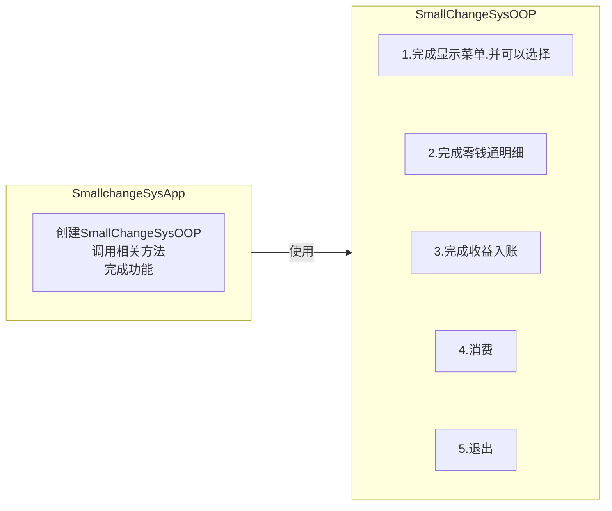

<meta name="viewport" content="width=device-width, initial-scale=1.0, viewport-fit=cover">


[返回目录](Home.md)


# 零钱通

[空降](https://www.bilibili.com/video/BV1fh411y7R8?t=970.7&p=342)


时间获取

```java
import java.util.Date;
Date date = null;
date = new Date();//获取当前日期

SimpleDateFormat sdf = null;//用于日期格式化

```

## 步骤
1）先完成显示菜单，并可以选择  
2）完成零钱通明细  
3）收益入账  
4）消费

## 改进


