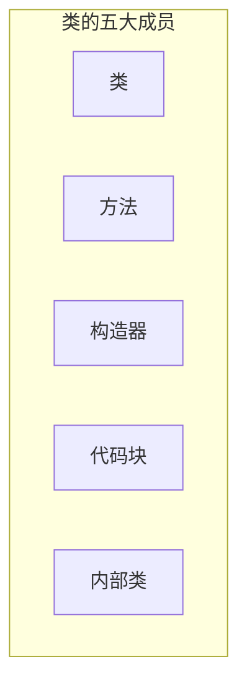

<meta name="viewport" content="width=device-width, initial-scale=1.0, viewport-fit=cover">

[返回目录](Home.md)

 

|基础||||
|:-:|:-:|:-:|:-:|
|[类与对象](类与对象.md)|[成员方法](成员方法.md)#⭐️ |[方法传参机制](成员方法传参机制.md)#⭐️ |[方法递归调用](方法递归调用.md)|
|[overload](overload) |[可变参数](可变参数.md) |[作用域](作用域.md) |[构造器](构造器.md) #⭐️ |
|[this](this.md) |
|中级||||
|[包](包.md)|[访问修饰符](访问修饰符.md)|[封装](封装.md) #⭐️ |[继承](继承.md) #⭐️ |
|[super](super.md)|[override](override.md)|[多态](多态.md) #⭐️ |[Object类详解](Object类详解-equals.md)|
|[断点调试](断点调试.md) |||
|高级||||
|[类变量和类方法 #⭐](类变量和类方法.md)|[main方法语法](main方法语法.md) |[代码块](代码块.md)|[单例设计模式](单例设计模式.md) |
|[final](final.md) |[抽象类](抽象类.md) |[接口](接口.md) #⭐️ |[内部类](内部类.md) #⭐️ |
||

[[面向对象编程-案例]]

备用

#### 基础
- [ ] [类与对象](类与对象.md)
- [ ] [成员方法](成员方法.md) #⭐️ 
- [ ] [成员方法传参机制](成员方法传参机制.md) #⭐️ 
- [ ] [方法递归调用](方法递归调用.md)
- [ ] [overload](overload) 
- [ ] [可变参数](可变参数.md) 
- [ ] [作用域](作用域.md) 
- [ ] [构造器](构造器.md) #⭐️ 
- [ ] [this](this.md) 
#### 中级
- [ ] [包](包.md)
- [ ] [访问修饰符](访问修饰符.md) 
- [ ] [封装](封装.md) #⭐️ 
- [ ] [继承](继承.md) #⭐️ 
- [ ] [super](super.md) 
- [ ] [override](override.md)
- [ ] [多态](多态.md) #⭐️ 
  	- [ ] [多态的应用](多态的应用.md)
- [overwrite](overwrite.md) 
- [ ] [Object类详解](Object类详解-equals.md) 
- [ ] [断点调试](断点调试.md) 
#### 高级 
- [ ] [类变量和类方法](类变量和类方法.md) #⭐️ 
- [ ] [main方法语法](main方法语法.md) 
- [ ] [代码块](代码块.md) 
- [ ] [单例设计模式](单例设计模式.md) 
- [ ] [final](final.md) 
- [ ] [抽象类](抽象类.md) 
- [ ] [接口](接口.md) #⭐️ 
  	- [ ] [接口vs继承类](接口vs继承类.md)
- [ ] [内部类](内部类.md) #⭐️ 

